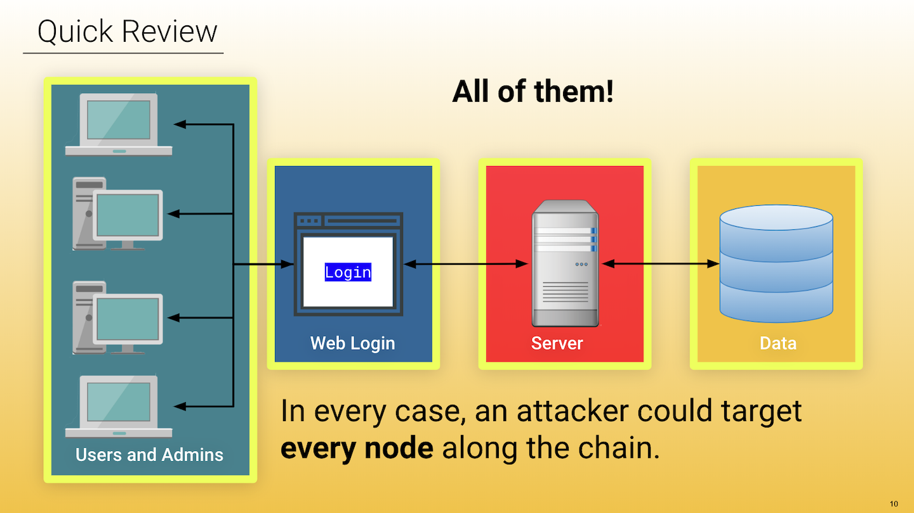
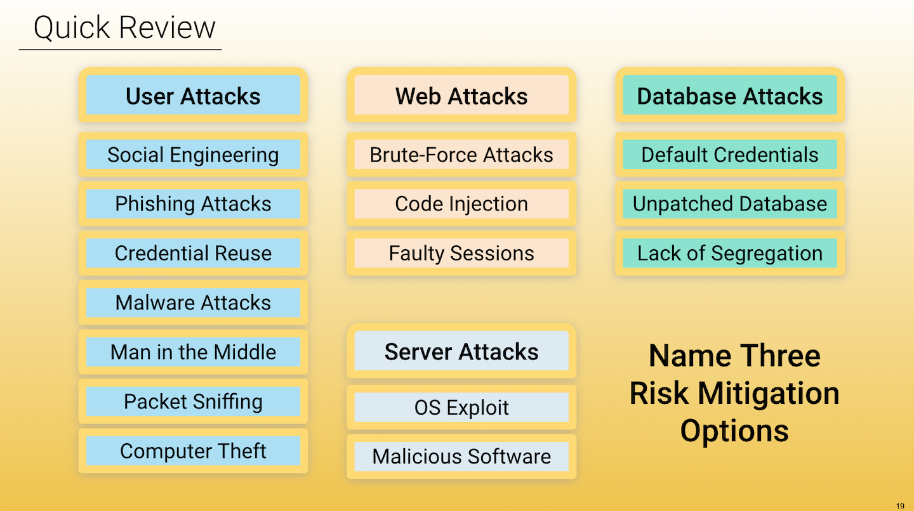
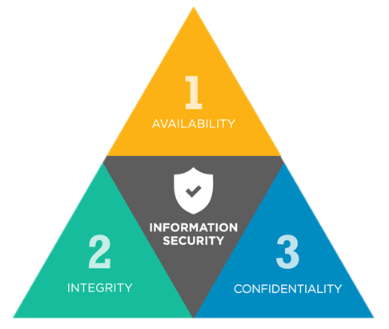
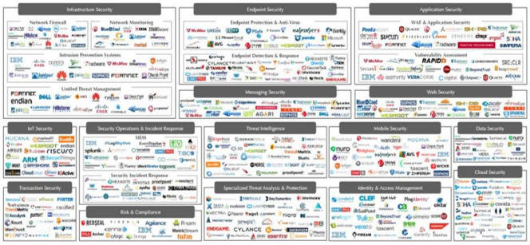

## 1.2 Student Guide: Surveying Cyberspace

### Overview 
In this class, we will cover the CIA triad, conduct research on specific vulnerabilities and threats, and will learn about cybersecurity roles and pathways. 

### Class Objectives

By the end of class, you will be able to: 

* Articulate a clear definition of the CIA Triad and its elements. 
* Define and contextualize technical terms found in recent cybersecurity trend reports. 
* Conduct research and analysis on a vulnerability, exploit, or threat actor to present to a non-technical audience using independent research. 
* Articulate roles and career pathways within the cybersecurity space.

### Slideshow

The lesson slides are available on Google Drive here: [1.2 Slides](https://docs.google.com/presentation/d/1jD8VxhoiaRE9-mtSAVa8eVNZvXEjAJ4A1PiMB5bUSDk)

- **Note:** Editing access is not available for this document. If you wish to modify the slides, please create a copy by navigating to File > "Make a copy...". 

---

### 01. Welcome and Overview  (0:10)

In the previous class we were introduced to the structure of the course and the staff who will be supporting them. We also covered the rise of cybersecurity, what it entails. Then, we dug into a thought exercise around attack and defense, and concluded with covering frameworks. 

* Cybersecurity focuses on two primary concepts: 

  * **Threat assessment**, the structured process of identifying the risks posed to a group or system 
  * **Risk mitigation**, the systematic reduction of the impact and/or the likely occurrence of a negative event. 

- So, why do we use the word "mitigation" and not "eradication"? 

  - We cannot eradicate all risks. Since cybersecurity is an ever-evolving landscape, new threats show up every day. Also, business needs and budgetary constraints often limit the ability to implement cybersecurity best practices. So we must do our best to mitigate.

  

- Nearly every single aspect of a web application - the webpage, the server, the database, even the users and administrators - can be seen as targets by a hacker. Can you name some different kinds of attacks that are utilized to target these nodes.

  

Today's class is focused on the theme: *Seeing the Big Picture*.

  - Let the class know that, throughout this course, they will be diving into the weeds of many complex topics. While learning the skills attached to these topics are important, understanding the context behind them is even more crucial.
  
  - In today's lesson in particular, you will be diving into the broad field that is cybersecurity and growing more comfortable in navigating it by learning key terms, resources, and understanding some common career pathways.

### 02. Defining the CIA Triad (0:10)

Now we'll take some time to investigate the three cornerstones of information security: **Confidentiality**, **Integrity**, and **Availability**.

Try to define the three key terms in your own words: What is confidentiality? What is integrity? What is availability?

- **Confidentiality**: The state of keeping or being kept secret or private. 
  
  - In essence this corner of the CIA triad is all about ensuring sensitive information does not reach unauthorized people. 
  
  - Some examples of confidentiality attacks include uploading private photos and communications onto a forum or having credit card numbers exposed online. 
  
  - Confidentiality comes down to the principle of "need to know". Data or information should only be made available to those who need access to it. 
  
  - Confidentiality is supported or enforced through other various measures like encryption, authentication, etc. 

- **Integrity**:  The quality of being honest, whole, or undivided. 

  - The integrity of information refers to protecting information from being modified by unauthorized parties. 

  - Some examples of integrity attacks include intercepting money transfers and changing the dollar amount in "insignificant" ways to allow for the excess to be siphoned off or altering the grades at a university to be better or worse. 

  - These kinds of attacks can be prevented by making sure there is a secure hashing algorithm and process when transferring data to ensure it wasn't tampered in transit.

- **Availability**: The quality of being able to be used or obtained. 

  - Availability concerns occur when operating systems, equipment, and data are not functioning correctly and thus are not accessible by those who need it. 

  - Some examples of an availability attack include hackers taking down a web-connected generator to disable a critical power supply or using a denial of service attack to bring down a financial service provider's website so as to make it impossible for clients to make transactions. 

  - Creating regular backups of data is one way to maintain availability 

Cybersecurity is concerned with the confidentiality, privacy, and integrity of data and data systems.

* We will revisit these terms throughout the program and will explain how the various topics, skills, and practices are concerned with protecting confidentiality, privacy, and integrity.

### 03. Student Do: CIA Triad and Security Scenarios (0:12)

### 04. Review: CIA Triad and Security Scenarios (0:08)

### 05. Kaspersky + Fortinet Map (0:10)

There are such a vast number of attacks that fit into each category of the CIA triad that newcomers to the field oftentimes find it hard to get up to speed. There are a lot of threats, a lot of technologies, and a lot of players out there which make it challenging to visualize what is really going on.

  

* Thankfully security maps like [Kaspersky's](https://cybermap.kaspersky.com/) give a great overview of "real-time" security threats since it visualizes the current cybersecurity landscape.

  * Navigate around the Kaspersky map for a while, clicking on individual countries in order to show the class what kinds of threats are being detected in those nations. Also head to the [Data Sources](https://cybermap.kaspersky.com/subsystems/) section to see what each of these lines represent.

  * Kaspersky is not the only visualizer of cyber threats. Navigate to the [Fortinet](https://threatmap.fortiguard.com/) in order to show a similar map of attacks... If a little less visually impressive or data-focused.

### 06. Student Do: Kaspersky + Fortinet Map Exploration (0:10)

### 7. Group Do: Threat Research  (0:45)

### 8. BREAK (0:15)

### 9. Instructor Do: Cybersecurity Domains (0:15)

Read the following quote from Tao Security's Richard Bejtlich on entering the cybersecurity field.

* _Providing advice on “getting started in digital security” is similar to providing advice on “getting started in medicine.”: If you ask a neurosurgeon he or she may propose some sort of experiment with dead frog legs and batteries. If you ask a dermatologist you might get advice on protection from the sun whenever you go outside. Asking a “security person” will likewise result in many different responses, depending on the individual’s background and tastes._

Explain to the class that the field of cybersecurity is so vast that it is often hard to get straightforward advice on how to enter the industry. This is because the advice of each professional will vary depending upon their background and tastes.

* Add specific examples around this if you can.

  

This map shows various cybersecurity domains and roles:

* **Security Architecture**: A unified security design that addresses the necessities and potential risks involved in a certain scenario or environment. It also specifies when and where to apply security controls. The design process is generally reproducible.

* **Security Operation**: The process that identifies critical information to determine if friendly actions can be observed by enemy intelligence, determines if information obtained by adversaries could be interpreted to be useful to them, and then executes selected measures that eliminate or reduce adversary exploitation of friendly critical information.

* **Governance**: The framework for managing performance and risk, oversight of compliance and control responsibilities, and defining the cyber mission by mapping the structure, authority, and processes to create an effective program.

* **Physical Security**: The protection of personnel, hardware, software, networks and data from physical actions and events that could cause serious loss or damage to an enterprise, agency or institution. This includes protection from fire, flood, natural disasters, burglary, theft, vandalism and terrorism.

* **Threat Intelligence**: Evidence-based knowledge, including context, mechanisms, indicators, implications and actionable advice, about an existing or emerging menace or hazard to assets that can be used to inform decisions regarding the subject's response to that menace or hazard.

* **Career Development**: The training of future cybersecurity professionals.

* **Risk Assessment**: Analyzes what can go wrong, how likely it is to happen, what the potential consequences are, and how tolerable the identified risk is.

* **User Education**: The process of teaching users how to protect themselves from cyber attacks by informing them of risks, exploits, and external threats as well as teaching them the skills needed to combat common attacks.

* **Framework and Standards**: The creation of new security frameworks amd practices for professionals to adhere to. 

Our program is primarily concerned with the technical aspects of cybersecurity, but we will connect these areas to the overall security organization and business.

* We'll dive deep into security operations and security architecture in this course. We'll also dive into penetration testing in this program, and discuss red team vs. blue team in depth.

* Governance and risk assessment are two of the primary topics we'll look at in depth next week. We'll also discuss the importance of user education and training as well. We'll  touch on physical security through the use of items such as physical key cards and the implementation of Disaster Recovery planning.

* Throughout this course we will weave in different frameworks and standards. It is important to understand how these affect the development and priorities of a security organization. Moreover, different industries follow different frameworks, which we'll discuss next week. 

### 10. Student Do: Cybersecurity Careers Research (0:10)

### 11.  Cybersecurity Roles and Pathways (0:20)

It's important for you to assess your existing skills and job level:
 
* Are you a career switcher or starter? Are you brand new to the security space? 
* If you have existing experience, what is it? Possibilities include:
    * Technical cybersecurity adjacent fields such as IT and networking. 
    * Technical experience such as software development.
    * Security experience such as SOC operations, security analysis, and security risk analysis and policy.

Similar jobs titles can have different skills and qualifications, so it's important to read the specifics of a job description. 

* You'll notice that many jobs such as security analyst don't necessarily expect candidates to have a lot of specific skills and tools. Many of these companies are amenable to teaching employees on the job. What's important is an ability to show your passion as well as ability and willingness to learn. 

* Ypu'll need to emphasize the importance of passion and the ability to learn. This program will push you past your comfort zones, but *learning how to learn* is a critical skill that employers look for. Also, always stay curious and keep up to date on cybersecurity news and trends. Complete projects or participate in activities like CTFs. In interviews, you should be able to talk about and demonstrate your passion and how you learn. 

* Do not be deterred by jobs that require years of experience that you feel like you do not have. If you are just starting out, a job that requires 6-8 years of experience is most likely out of reach, but a job that requires 2 years of experience is often not. 

  * Employers will often intentionally put higher years of experience than a job actually requires in order to avoid a deluge of applicants. 

Note the following statistics:

* According to a report from Frost and Sullivan and (ISC)2 there will be more than 1.5 million unfilled cybersecurity positions by 2020.

  * A similar report conducted by ISACA found that 53% of organizations experience delays as long as 6 months to find qualified cybersecurity candidates; cybersecurity jobs grew at a rate 3x as fast as IT jobs as a whole between 2010-2014; and 84% of organizations believe half or fewer of its applicants for open security jobs are qualified. 

  * Also, according to (ISC)2, a full 87% of all cybersecurity professionals started their careers doing something different. This means that the majority of cybersecurity professionals come from similar backgrounds to you!

Let's transition into career pathways. While it’s possible to leap frog between steps a bit, to some degree the cybersecurity industry is looking for proven experience when hiring. If you’re new to the field, you may have to take lumps to get your foot in the door.

* However, it's important to point out that because of the increased demand for security professionals, you can also shorten some of the years of experience required. We have had complete beginners in our program, for example, obtain network administrators, SOC analyst, and security analyst jobs. 

* Point out that we'll now discuss common job titles and where they fit along different pathways.

  * **IT Support Specialists,** **Computer Help Desk Specialists**, and other similar titles are entry level jobs for all beginners. 
  
  * **Systems Administrator** and **Network Administrator** jobs are also entry level jobs in the networking space. 
  
    * Technical cybersecurity roles require a strong foundation in networking, which our program covers. We also provide relevant cybersecurity context to our networking modules, so that they are still relevant for those of you who already have sys admin or networking experience. These are roles that are within reach for career switchers and starters.
  
    * Networking roles focus on configuring and maintaining networks, and can often include security-related tasks such as monitoring logs, implementing firewalls, and maintaining network-based backups. 

* There are a range of entry level security jobs, which are focused on the operations and defensive side of security. Our program will equip you with the skills to obtain these roles, which many of our graduates have done.
 
  * **SOC Analyst** is the most common entry-level security job. Specifically a Tier 1 SOC Analyst can be hired with no prior professional experience. They work at Security Operations Centers within an organization, monitoring and analyzing network traffic. They are on the front lines and are responsible for monitoring the security of users, systems, and the network. They detect and investigate suspicious and potentially malicious activity on the network and within systems
 
  * **Security or Information Specialists/Analysts** is a broad term that can encompass different skill levels and responsibilities, so it is important to always read the job description, specific skills, and qualifications. They work to actively protect an organization from security threats and breaches. Common responsibilities for entry level roles include keeping up to date with security improvements, monitoring and protecting security systems, implement security tools and protocols, develop security requirements, analyze security policies and protocols for weaknesses and flaws, and design and develop training. 
 
  * **Information Assurance Technicians**  protects computer assets by establishing/documenting access and maintaining files.
 
  * **Forensics Specialists** come in after a crime has been committed. They will analyze logs and other data to determine what occurred. Some common responsibilities include conducting security incident investigations, recovering and examining data from computers and other devices, compiling evidence for legal cases, writing technical reports, preparing evidence for trial, and work with law enforcement on the validity and preservation of data. 
  
  * **Risk Analyst** use their knowledge and experience to examine systems and procedures to identify potential adverse events, including hardware and software crashes, physical disasters, malicious intruders, malware, denial of service attacks and employee misconduct. While a technical background is beneficial 
  
  * **IT Auditors** are responsible for the internal controls and risks of a company’s technology network. This role includes identifying the weaknesses in a systems network and creating an action plan to prevent security breeches in the technology.

* Typically with some years of experience in the above roles, people can move on to more mid-level to advanced roles such as the ones below. Many mid-level and advanced-level roles may also require additional certifications. 
  
  * **Security Engineers**  will test the network for vulnerabilities, monitor for security breaches, and develop security plans and policies. Common responsibilities can include installing and configuring firewalls and intrusion detection systems, performing vulnerability testing and security assessments, evaluate new technologies and test existing security solutions, and defining, implementing, and maintaining security policies. Many of these responsibilities are similar to those of a security analyst, but these are more advanced and often more technical.
  
  * A **Penetration Tester**or **Ethical Hacker**, is often hired by a company to test and break into their security controls and defenses, identifying and reporting vulnerabilities and flaws in a system, by using specific tools to simulate cyberattacks. The end goal is to help these companies improve their security posture. Pentesters need to strongly understand the types of systems they’re trying to break into. They usually specialize in specific systems such as networks, web applications, and mobile applications. 

* Chief Information Officers (**CIO**) and Chief Information Security Officers (**CISO**) are advanced managerial level roles in cybersecurity. Certifications such as CISSP+ are often required.

### 12. Using our Career Services Department (0:05)

Career Services department is available from Day 1 of the program. 

* While we will tie concepts and skills in our program to career outcomes and roles, the Career Services team will do the practical, hard work of helping you obtain a new role or promotion.

* There are several career milestones for you to complete that you'll find in Bootcamp Spot.

  * You have access to them all now and can submit milestones whenever you would like to in the program. 
  * However, you will need to submit at least one milestone in order to unlock Career Services. 
  * One of the milestones, an updated, polished resume, will be a requirement in one of our later homework assignments, but you can submit this earlier if you'd like. 
  * Review the slides on Becoming Employer Competitive, Working with Your Profile Coach, and Working with Your Career Director.

* This week's homework will contain more details around Career Services. If you do not know who their Career Director is, reach out to your Student Success Manager. 

---

### Copyright

Trilogy Education Services © 2020. All Rights Reserved.
