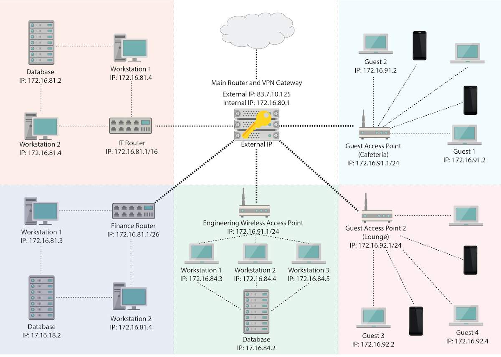
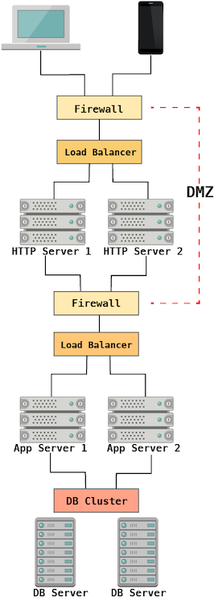

## Activity File: Threat Modeling, Steps 1-4

Today, you’ll play the role of a security consultant contracted to advise a financial technology firm called GeldCorp.

Their finance department recently experienced a major breach and have already developed a training plan to address the problem. However, they would also like to make absolutely sure they don’t get hit with another unexpected breach in the future.

Your assignment is to help GeldCorp better understand where its core networks are most vulnerable to attack and advise them of what is most important to protect. 

You’ll do this by analyzing the business and its assets, then applying the OWASP Threat Modeling Process in a series of exercises throughout the day.

In this activity, you’ll read about the business and its assets, then apply Steps 1-4 of the OWASP Threat Modeling Process:

- **Understanding Assessment Scope**

- **Identify Threat Agents**

- **Identify Possible Attacks**

- **Identify Exploitable Vulnerabilities**

Get started by reading about the business and its assets below. Find the instructions for the threat modeling exercise after that.

Be sure to ask your instructors and classmates for help if you get stuck.

Good luck!

### GeldCorp Overview

GeldCorp is a financial technology firm that helps clients manage and optimize their stock portfolios. They offer two main services:

- Custom Trading Platform: A web application that clients use to transfer money between their bank and trading accounts; buy and sell stock; and enable automated trading features.

- Financial Advising: GeldCorp also allows clients to purchase advisory services. This service gives them one in-person meeting with a financial advisor every quarter. It also grants them access to the Live Chat feature, which they can use from the web application to request advice 24/7.

GeldCorp offers these services separately, and therefore runs them as separate businesses. For this assignment, you’ll focus specifically on assessing the network assets that these businesses rely upon. Then, you’ll identify the threat agents, possible attacks, and exploitable vulnerabilities relevant to its most critical assets. 

Read the information below and answer the questions in the Threat Modeling section at the end of the document.

### Network Infrastructure

Network infrastructure includes all the devices that make up a network and aid in transporting data across it. These include routers, firewalls, and switches, which we’ll cover in-depth during our Networks units. For now, we’ve provided brief descriptions of the relevant devices in this activity 

**Corporate Intranet**: Refer to the topology below for a simplified diagram of the Corporate Intranet.

A corporate intranet is a private computer network that allows access only to authorized employees. It’s used to securely share company information and resources, amongst other purposes.

A network topology shows how the nodes, or devices, are arranged and connected to one another in a network. We’ll dive into topologies in the Networks unit, but for now, note that they are often depicted in maps like the one in this activity.

  

- Router (receives Internet, receives VPN, provides DHCP)

  A Router is a networking device that forwards- or routes- resources to other networks. In this case, the routers is the hub that sets up the corporate intranet and manages all of the devices on it.  It receives internet, is a VPN gateway, and provides DHCP. 

  Routers can forward resource to other routers, computers, and access points. An access point is a device - such as a router - that allows other devices to connect to a network. It allows in part for more devices to be on the network.

- Domain Controller (Windows AD “command center”)

  A domain controller is a Windows server that manages network security and is responsible for user authentication and authorization. It’s a primary way for authenticating users on the network.

- Department Routers (receive forwarded Internet, VPN)
   Each department has an associated domain name

- Department Databases

   Each department has private databases in their own subnets. We’ll discuss subnets in depth during Networks, but for now note that subletting allows large networks to be divided into smaller networks, and each of these subnets has its own set of IP addresses.
  
   All employees in a department have full access to all databases.

- The entire network is managed with Windows Active Directory. We’ll learn more about Active Directory during the Windows unit, but for now know that AD is a directory service for Windows domain networks. Among other tasks, it is used to manage devices on a network.

  The network and system administration team keep all systems fully patched at all times. GeldCorp does not enforce content filters, meaning that employees can visit any sites they want.

Note the following additional information:

- Each department has its own subnet.
- Employees who connect to the intranet from home must use the VPN.
- All employees in a given department have access to all of that department’s data servers.

**Web Application Infrastructure**

Refer to the topology below for a simplified diagram of the trading platform’s network infrastructure.

A DMZ is a portion of the network that is intentionally exposed to larger external networks. Oftentimes, this will include the internet. It acts as a buffer between the public internet and the network itself. This means that there is a firewall that will screen all network data coming from the internet. There will also be a firewall that will screen the data that passes from the DMZ to the larger network. Load balancers are then responsible for efficiently distributing the incoming network traffic to various servers in the network.

GeldCorp has a lot of clients, so it has several HTTP Servers instead of just one. This ensures the app doesn’t crash due to too many incoming HTTP requests.

The App Servers run the core web app, which lets users transfer funds to their trading accounts; buy and sell stock; and enable automated trading. This last feature requires the App Servers to also run GeldCorp’s top-secret trading algorithms.

The Database stores the following PII about each user:

  - Name, address, and phone number, and SSN. Used to automate bank transfers.

  - Account Balance, which records how much cash the user has to buy stocks. 

  - Portfolio Data, including which stocks each user owns, and how much each is worth.

  - Trading History. This is a record of every trade the user has made. Account Advisors and automated trading algorithms use this to make trades for their clients.

Note the following additional details:

- These applications are built entirely in-house, including code used to process user input. In other words: GeldCorp does not use frameworks. They only build from scratch.

- All of the servers run on top of Linux. They are all fully patched and hardened.

- These applications have never been pentested, but IR has identified no breaches thus far.

#### Questions:

In reading the above, you’ve completed **Step 1** of the **OWASP Threat Modeling** process,which is to familiarize yourself with the Assessment Scope.

Follow the instructions below to complete **Steps 2-4** for both the corporate intranet and web application infrastructure.

#### Web Application Infrastructure:

1. Identifying the most important assets on the web application network:

      - **Identify Threat Agents**: List **three** threat agents relevant to the web application.

      - **Identify Possible Attacks**: List **five** attacks relevant to the web application and which threat agent is most likely to use each one. Be creative; while we'll cover web attacks later in this course, use Google to help you with identifying these attacks.

      - **Identify Exploitable Vulnerabilities**: Identify **three** possible vulnerabilities in the web application infrastructure, and rank them in order of severity. Explain how each one could be exploited. Similarly use Google to help you identify potential exploitable vulnerabilities. 

##### Corporate Intranet

2. Identifying the most important assets on the corporate intranet:

    - **Identify Threat Agents**: List three threat agents relevant to the intrane: 

    - **Identify Possible Attacks**: List **three** attacks relevant to the intranet, and which threat agent is most likely to use each one.

    - **Identify Exploitable Vulnerabilities**: Identify **three** possible vulnerabilities in the intranet, and rank them in order of severity. Explain how each one could be exploited.