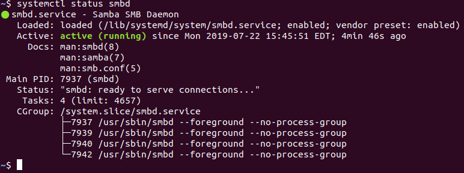
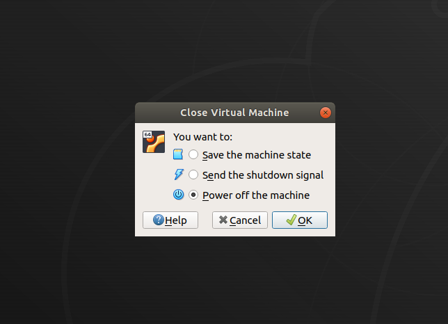
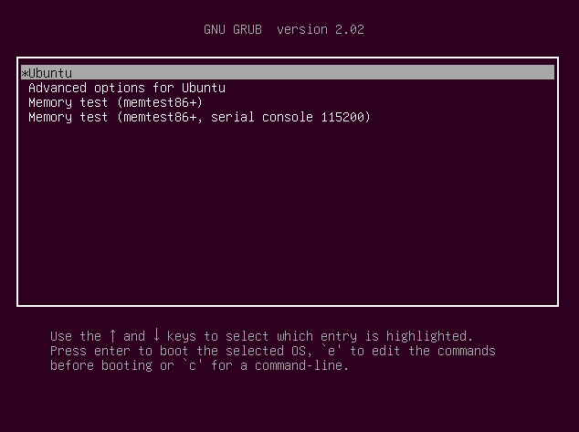
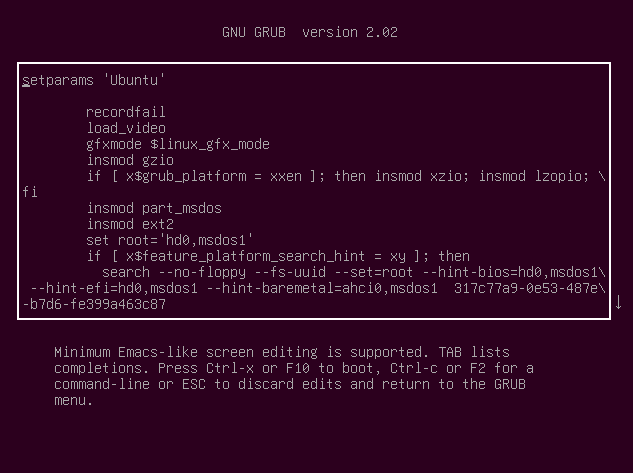
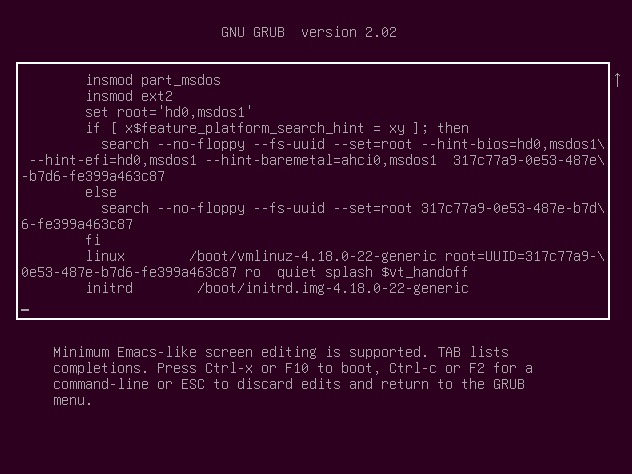
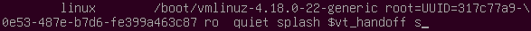
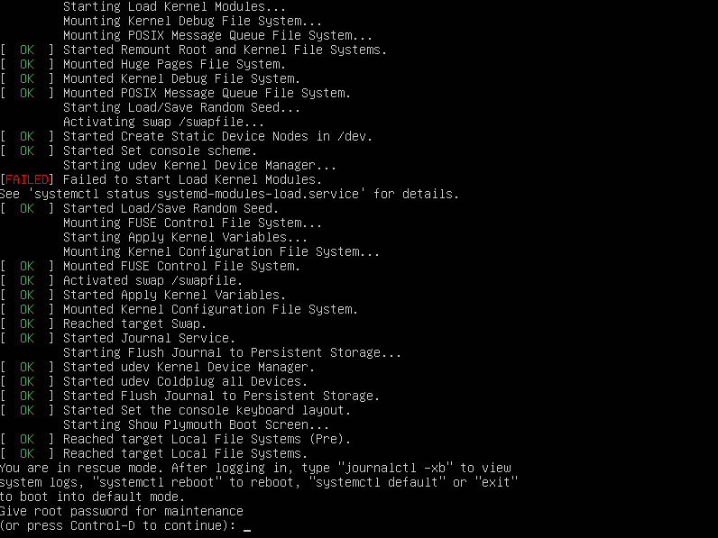
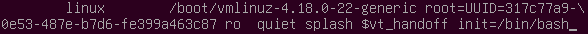
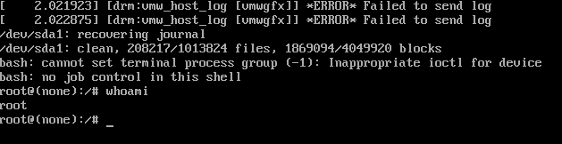

## 4.3 Student Guide: Special Permissions and Managing Services
 
### Overview

Today's class will continue our introduction of Linux by covering more topics related to auditing a malfunctioning system, ranging from the `SUID`, `GUID`, and sticky bits, to service users, managing services, and securing the root account.

### Class Objectives

By the end of today's class, you should be able to to:

- Set file permissions on programs using the `SUID` or `GUID` bits.

- Manage and monitor services on the system, including removing unused services.

- Create and assign users for services.

- Secure the boot loader against single user attacks.


### Lab Environment and Class Materials

Today's lesson will use the **Ubuntu** lab environment. To access it: 

 - Log into the Azure Classroom Labs dashboard; find the card with the title **Ubuntu**.
 - Click the monitor icon in the bottom-right.
 - Select **Connect with RDP**.The lab should already be started, so you should be able to connect immediately. 

Refer to the [lab setup instructions](https://cyberxsecurity.gitlab.io/documentation/using-classroom-labs/post/2019-01-09-first-access/) for details on setting up the RDP connection. 

### Class Slides

The slides for today can be viewed on Google Drive here: [4.3 Slides](https://docs.google.com/presentation/d/1fGQ_6LRG15sNt-J3I42Rl7kQbTcXBG2JpvQPcJD_p50)

---

### 01. Welcome and Review

Welcome to class. Last class, we practiced:

- Auditing passwords using `john`.

- Elevating privileges with `sudo` and `su`.

- Creating and managing users and groups.

- Inspecting and setting file permissions for sensitive files on the system.

Today we will pick up with a special kind of permission on the system before moving on to services and service users, and some physical security topics.

- While no system is completely safe, there are many steps we can take to make a system more difficult for an attacker to exploit.

- Our strategies revolve around reducing attack surfaces and continuing to practice the principle of least privilege.

- We will continue our junior Linux administrator scenario, learning a few more techniques to protect the system.  

- This week's homework will use all of the new techniques you have learned.

### 02. `SUID`, `GUID` and Sticky Bits

- Previously, we learned about permissions for files and folders and how we can set or remove `r`, `w` or `x` for every file or folder.

- We can specify whether an item's owner can read, write or execute an item; whether a group of users can read, write, or execute an item; and whether every user on the system can read, write, or execute an item.

- We learned about the use of `sudo` and that invoking the root user allows you to bypass any permissions that are set on an item and execute a command with root privileges.

- We learned how to assign the ability to use `sudo` for just one command to a particular user.

We will now look at "special bits," which provide unique permissions for programs in specific circumstances. 

#### Special Permissions

There are a few unique circumstances in which **special permissions** can modify an item's permissions to allow more flexible application across users. 

For example, look at the `passwd` command:

- The `passwd` command allows a user to change their password.

- However, in order to change a password in the system, the `passwd` program has to edit the `/etc/shadow` file where all the password hashes are stored.

- `passwd` has to have `root` privileges in order to edit the `/etc/shadow` file and update the password hash.

- Remember, we never edit the `/etc/passwd` file manually. It is only edited by the system when a user is created or removed, or when a user's password is changed and it is owned by the `root` user.

Rather than manually giving all users `sudo` access for this command and then making sure every new user added also gets `sudo` access, we can have `passwd` set to **always run on `root`, regardless of the user running the command**. 

 - This setting is considered a **special permission**, designed for unique scenarios, that modifies an item's behavior for when standard permissions are not flexible enough.

There are three basic scenarios that call for special permissions:

1. Allowing multiple users to make changes to the same files inside a common directory.

2. Limiting users to _only_ make changes to their own files within a common directory.

3. Allowing any user on the system to run a specific program as the root user.
  
    - This scenario is the case for the previous `passwd` example.  

For each of these three scenarios, there is a different special bit setting that we can implement into an item's permissions.

#### Special Bits

If we think of the `r`, `w`, and `x` bits as the standard characters that set an item's permissions, the _special bits_ are the characters we add to the item's permissions for those unique circumstances:

- Special bits are displayed alongside the permissions of an item, where the _execute_ bit normally is. 

  - The `x` setting is still present, it's just not displayed.

- The special bit and the execute settings are used in conjunction with each other. When using a special bit, you first allow execute permissions before setting the special bit.

- There are three special bit options, one for each of the `x` permissions: owner, group, and  other. 


- We can enable or disable these bits using the same `chmod` command we learned in the previous class, and we can use either symbolic or octal notation.


The **Sticky** bit resides in the execute position for the **other** permissions.
  - Restricts users from making changes to other users' files inside a shared directory.
  
  - Is displayed with a `t` in the place of the `x` for the other permissions: `drwxrwxrwt`.
  
  - If set without first setting the `x`, is indicated with a capital `T`: `drwxrwxrwT`.
  
  - It can be set with `chmod o+t` or `chmod 1000`.

The **Set Group ID** (`SGID`) bit resides in the execute position for the **group** permissions.
  - Grants all users the same permissions as the group assigned to a shared directory.
  
  - Allows multiple users to make changes to the same directory.
  
  - Displayed with an `s` in the place of the `x` for the group permissions: `-rwxrwsr-x`.
  
  - If it is set without first setting the `x`, will be indicated with a capital `S`: `-rwxrwSr-x`.
  
  - It can be set with `chmod g+s` or `chmod 2000`.
  
  - The `SGID` bit _can_ be set on a file. However, the effect is similar to setting the `SUID`, so it is rarely done.
    
    
    **Note**: the `SGID` and sticky bits can be used together to allow a group of users to collaborate in the same directory. When set together, they allow users to make changes to the same directory, but only to files that they own. 


The **Set User ID** (`SUID`) resides in the execute permission for the **owner** permission.
- Allows any user to run a program as if they were the owner of that program.

- Usually used with executable files owned by `root`, giving any user the ability to execute that file with root permissions.

- Only used on files that have the `x` bit set in the owner position. In other words, it is only used on executable files or programs.

- A correct configuration displays an `s` in the place of the `x` for the user permissions: `-rwsr-xr-x`.

- In the event that the `x` is not set prior to setting the `SUID`, a capital `S` is shown to signal misconfiguration: `-rwSr-xr-x`.

- It can be set with `chmod u+s` or `chmod 4000`.


Of the three special bits, the `SUID` bit is the most important for security. 

- The Set User ID or `SUID` bit will be the focus of the upcoming demo and activity.

- This bit is important to understand as it has similar vulnerabilities as `less`, which we covered in the previous class.


Setting the `SUID` bit is reserved for a few system programs like `passwd`.

- These programs have been well-tested for vulnerabilities and, so far, have been found secure.

- This setting should not be used on other programs, no matter how convenient it might be.

- Attackers often try to change this bit on programs they know they can exploit later.

Run `ls -l /usr/bin/passwd`. The output should be:

```
-rwsr-xr-x 1 root root
```
- `root` has `rwx`, the `root` group has `r-x`, and everyone else has `r-x`.

Each process running on the system shows the user that started the process.

Normally, when a program is run, the system runs it under the user that started the process.  

-  However, in this case, everyone has permission to execute the `passwd` program. But no matter who starts it, it will run as if it was started by the `root` user, because `root` is the owner of the `passwd` program and the `SUID` bit is set.


#### Demo Setup

In the upcoming demo, we will use the following scenario:

- A web developer at your company asked for `sudo` access to run the `find` command on a web server, so he can search the entire system for misplaced configuration files. He also stated that other developers will want the same privilege and suggested setting the `SUID` bit on the `find` command so they can all use `find` with root privileges.

This demo will explore _how_ to change this setting, and _why_ we should not. By the end of the demo, we will find that setting the `SUID` bit is dangerous, as it opens a vulnerability for attackers to perform privilege escalations.

To complete this demo, we will:

- Turn on the `SUID` setting of the `find` command.

- Confirm that this introduces a vulnerability to the system.

- Turn off the `SUID` setting for the `find` command.

- Search the system for other programs that have the `SUID` bit set.

To accomplish these tasks we only need a few familiar commands:

- `chmod` to change each bit.

- `find` to find all of the files and directories that have one of these bits set.


#### `find` Demo

We will now look at the `find` command as described in our administrator scenario.

Display the path of the `find program`:

- Run `which find`

  ```bash
  $ which find
  /usr/bin/find
  ```

List the contents and note that the current permissions do not have `SUID` set.

- Run `ls -l /usr/bin/find`

  ```bash
  $ ls -l /usr/bin/find
  -rwxr-xr-x 1 root root 252848 Nov 5 2018 /usr/bin/find
  ```

Set the `SUID` bit.

- Run `sudo chmod u+s /usr/bin/find`

  ```bash
  $ sudo chmod u+s /usr/bin/find
  ```

Display the new permissions.

- Run `ls -l /usr/bin/find`

  ```bash
  $ ls -l /usr/bin/find
  -rwsr-xr-x 1 root root 252848 Nov 5 2018 /usr/bin/find
  ```

To set this bit using octal notation, run `sudo chmod 4755 /usr/bin/find`. 

- Syntax breakdown: 

    - `4` sets the `SUID` bit.

    - `7` sets `r`, `w` and `x` for the user.

    - `5` sets `r` and `x` for the group.

    - `5` sets `r` and `x` for everyone else.


- Run `ctrl + u` to clear the prompt.

If `find` is running as `root`, it can search through all the directories on a system without permissions errors, so setting the `SUID` bit here may seem to make sense. 

Remember what happened when the program `less` was run with `sudo`:

- That vulnerability emphasized the dangers of running a program with root privileges.

- Once `less` is running with root privileges, anything `less` can do, it will do it with root privileges, including running other commands.

Remember that you must use `find` with the `-exec` flag to run another command on the list resulting from `find`.

-  The `-exec` flag lets you run _another_ command directly after the `find` command. The `-exec` flag is just an option for `find`, so it _also_ runs with the same permissions as `find`.

In order to take advantage of this vulnerability, we want to search for an item we already know exists, so we can use the `-exec` command right after to run another command. In other words, `find` will have to return something in order for us to use the `exec` flag and a second command. The second command does need to use the output of the first command; it *only* needs the first command to have something returned. 

First we will run a regular `find` command.

- Run `find /etc -iname passwd`

   - Syntax breakdown:

        - `find` runs the search command.
        - `/etc` is the location we are searching.
        - `-iname` stands for _in name_ and means that we are searching for a specific  string in the name of the item.
        - `passwd` this is the string we are searching for in the name of the item. 

We are intentionally searching for `passwd` inside the `/etc` directory, because we know that `/etc/passwd` exists and our find command will be successful.

- Output should be:

  ```bash
  /etc/cron.daily/passwd
  /etc/pam.d/passwd
  /etc/passwd
  ```

We are searching inside a directory owned by `root` and we are not getting any permissions errors. This is because the `SUID` bit is set and `find` is running as `root`.

To use the `-exec` flag, run `find /etc -iname passwd -exec ls -l {} \;`.

   Syntax breakdown:

- `find /etc -iname passwd` is searching the `/etc` directory for anything with `passwd` in the name.
-  `-exec` allows us to run another command directly after find.
- `ls -l` is a command that lists the _long form_ of the item.
-  `{}` indicates the list of items returned from the `find /etc -iname passwd` part of the command.
- `\;` closes the find command.

In this case, the `ls -l` command is _also_ running as root.

- Run `find /etc -iname passwd -exec ls -l {} \;`

- The output should be:

  ```bash
    -rwxr-xr-x 1 root root ... /etc/cron.daily/passwd
    -rw-r--r-- 1 root root ... /etc/pam.d/passwd
    -rw-r--r-- 1 root root ... /etc/passwd
  ```

Remember that the output of the first `find` command doesn't need to be used by the second command. In other words, we can run a second command that doesn't have  anything to do with the output of the initial `find` search. 

Remember that the `whoami` command displays the user that is running that command.

- Run `find /etc -iname passwd -exec whoami \;`

    - Syntax breakdown:

        - `find /etc -iname passwd` is searching the `/etc` directory for anything with `passwd` in the name.
        - `-exec` runs a second command on each item returned by the first command.
        - `whoami` shows what user is present.
        - `\;` closes out the find command.

- Output should be:

    ```bash

    root
    root
    root

    ```

`whoami` was run for each time an item came back from the `find` search.

- We didn't need to use `{}` for this command, because we aren't trying to run `whoami` _on_ each item of the output of the `find` command.

- Instead we just want `whoami` to run independently.

What are some _other_ commands you could run that might be more sinister?

- This vulnerability would allow us to read sensitive files or install malicious packages. 

This is another example of why root privileges must be restricted. It also demonstrates that using the `SUID` bit must be reserved for programs that have been fully tested for security holes.

It is common for administrators to keep a list of all the files that have these bits set on a fresh system, and then refer to that list later to make sure no changes have been made.

- The files that are set by default are established Linux programs that have been well-tested for vulnerabilities.

- But it is best practice _not_ to set these bits on your own files or programs and to monitor for changes, as attackers like exploit these weaknesses.

What is the best way to locate all of the programs on a machine that have the `SUIC` bit set?

- The `find` command actually has a function for searching by permissions using the `-perm` flag.

- We can use either symbolic or octal notation here.

- Type `find / -perm -u+s -type f`

   - Syntax breakdown:

        - `sudo` would normally be used, but `find` currently has the `SUID` bit set, so we don't need to include `sudo` here.
        - `find` searches the system for files and directories.
        - `/` indicates that we are starting our search from the `root` directory and searching the entire system.
        - `-perm` is the flag that searches by permissions.
        - `-u+s` is the symbolic notation that sets the `SUID` bit.
        - **Note:** `-` must be used here, otherwise it will search for an _exact_ match, or files that _only_ have the `SUID` bit set and no other permissions.

Change the `-u+s` portion of the command to octal notation.

Type `find /perm /4000 -type f`

- Syntax breakdown:

    - `/4000` is the octal notation for the `SUID` bit.
  - **Note:** `/` must be used here, otherwise it will search for an exact match, or files that only have the `SUID` bit set and no other permissions.

Run the command. Your output should be similar to this:

```bash
/usr/lib/openssh/ssh-keysign
/usr/lib/eject/dmcrypt-get-device
/usr/lib/dbus-1.0/dbus-daemon-launch-helper
/usr/lib/qubes/qfile-unpacker
/usr/lib/xorg/Xorg.wrap
/usr/lib/policykit-1/polkit-agent-helper-1
/usr/sbin/pppd
/usr/sbin/exim4
/usr/bin/newgrp
/usr/bin/chsh
/usr/bin/pkexec
/usr/bin/gpasswd
/usr/bin/chfn
/usr/bin/passwd
/usr/bin/find
/usr/bin/sudo
/sbin/pam-tmpdir-helper
/opt/brave.com/brave/brave-sandbox
/bin/ntfs-3g
/bin/su
/bin/umount
/bin/fusermount
/bin/mount
/bin/ping
```

Except for the `find` command, the programs listed here have `SUID` set by default and have been well-tested.

Many administrators will save this list to a file and use it during an audit to verify nothing has changed.

Finally, we want to remove the `SUID` permission for `find`.

To remove the `SUID` bit for `find` using symbolic notation: 

- Run `sudo chmod u-s /usr/bin/find`

In order to remove the `SUID` bit using octal notation, we just use a `0` in the special bit location.

Type `sudo chmod 0755 /usr/bin/find`

   - Syntax breakdown:

        - `0` removes any special bit set.
        - `7` sets read, write and execute for the owner permissions.
        - `5` sets read and execute for the group permissions.
        - `5` sets read and execute for the other permissions.

Run `ctrl + u` to clear the prompt.

Run `ls -l /usr/bin/find` to verify your permissions are back to normal. Output should be:

```bash
$ ls -l /usr/bin/find
-rwxr-xr-x 1 root root 252848 Nov 5 2018 /usr/bin/find
```

### 03. Activity: Shutting Out `SUID` 


- [Activity File: Shutting Out `SUID`](Activities/03_Shutting_Out_SUID/Unsolved/Readme.md)


### 04. Activity Review: Shutting Out `SUID` 


- [Solution Guide: Shutting Out `SUID`](Activities/03_Shutting_Out_SUID/Solved/Readme.md)


### 05. Managing Services

- The next lecture, demo, and activity will focus on managing services, a common activity for sysadmins.

#### A Brief Introduction to Services and the SMB Exploit

- **Servers** are just computers that offer **services** to other computers.

- A **service** is a function/capability that one machine makes available to another. For example, file sharing services allow computers to send and receive data.

- Some services are only run locally on the server and not provided to other computers. Tripwire is an example of a local security service.

- These services are packages that you can install and remove, just like other programs.

Manipulating services to do things they are not designed to do is a common form of attack.

- Administrators are responsible for securing services that are running and removing services that are not in use.

- It's crucial for system administrators to be able to start, stop, and inspect services, to ensure they're running when they should be.

In this following demo, you will `find`, `stop`, and `uninstall` an unnecessary Samba file-sharing service.

Samba (also known as SMB) is a protocol that allows users to view, download, and store files remotely.

- It is commonly used for file-sharing among Windows computers, but Linux can use it as well.

- SMB is extremely useful for legitimate users, but has obvious security risks.

- If a malicious user is able to gain access to a shared folder, they can exfiltrate, alter, or delete sensitive files.

- SMB can be secured, but often isn't. Attackers frequently target SMB and similar services for just this reason.

#### Finding and Stopping SMB Demo

Since this server has already been compromised, you will proceed by stopping the SMB service, and then uninstalling it from the system. This will require the following steps:

1. Listing all running services.

2. Identifying the Samba service in the list to verify that it's running, then stopping it.

3. Ensuring that Samba doesn't start when the machine is started up.

4. Ensuring that Samba is no longer running.

5. Uninstalling the Samba service completely.

`systemctl` has a lot of options, but, to complete these actions, we only need to know the following:

- `systemctl -t service --all` to list all the running services.

- `sudo systemctl stop <service-name>` to stop the service.

- `sudo systemctl disable <service-name>` to stop a service from starting automatically when the machine starts.

- `systemctl status <service-name>` to determine if a single service is running.

- `apt-get remove <service-package-name>` to remove the service from the system.

Run `systemctl -t service --all`

- Syntax breakdown:

    - `-t` stands for type.
    - `--all` ensures that we see all the available services on the system, even if they aren't running.

Output should be similar to:

```bash
 UNIT                                  LOAD      ACTIVE   SUB    DESCRIPTION                           
  apparmor.service                     loaded    inactive dead    AppArmor initialization                                          
  apt-daily-upgrade.service            loaded    inactive dead    Daily apt upgrade and clean activities                           
  apt-daily.service                    loaded    inactive dead    Daily apt download activities                                    
  auditd.service                       not-found inactive dead    auditd.service                                                   
  avahi-daemon.service                 loaded    inactive dead    Avahi mDNS/DNS-SD Stack                                          
```

Note the following:

- `UNIT` has the name of the service.

- `LOAD` shows if the service module is found on the system or not.

- `ACTIVE` shows the high-level, general state of the service.

- `SUB` shows the low-level, detailed service state (this changes depending on the service).

- `DESCRIPTION` describes the service.

We can easily see services that the system has searched for and are not found on the system. Those are marked in red under the `LOAD` column and have a yellow dot to the left of the service name.

We will practice how to identify the `smbd` process and then stop and disable it.

We are _enabling_ and _disabling_ a service to configure whether or not it starts automatically on system boot.

- Run `systemctl -t service --all` and note the `smbd` service.

- Run `sudo systemctl status smbd` to get the status of the `smbd` service.

- Your output should be similar to:

  

  - Note the service is marked as `Active: active (running)`.

- Run `sudo systemctl stop smbd` to stop the service.

- Run `sudo systemctl status smbd` to get the status of the `smbd` service again.

- Your output should be similar to:

  

  - Note the service is marked as `Active: inactive (dead)`.

- Run  `sudo systemctl disable smbd`

Services are just packages. To remove a package, run `sudo apt-get remove <service name>`.

- Run `sudo apt-get remove samba`

If you accidentally `stop` or `disable` the wrong service, you can use `start` and `enable` to reverse the action.

We have removed Samba from the system, so the following commands won't work. But if we wanted to start and enable that service, we would use:

- `sudo systemctl enable smbd` to enable a service.

- Press `ctrl + u` to clear the prompt.

-  `sudo systemctl start smbd` to start a service.

### 06. Activity: Managing Services 


- [Activity File: Managing Services](Activities/06_STU_Managing_Services/Unsolved/Readme.md)


### 07. Activity Review: Managing Services


 - [Solution Guide: Managing Services](Activities/06_STU_Managing_Services/Solved/Readme.md)


---

### 08. Break

---

### 09. Service Users

So far, we have found and removed a vulnerability with the `find` command using the `SUID` and `SGID` bits. Then, we found and removed some old, unused, and insecure services.

Next, we are going to look at managing service users and then end the day with a section on securing the root account.

- Services should run in a user dedicated to running that service.

- Running services in a dedicated user offers a number of security benefits. In particular, it makes it easier to start, stop, and manage the service, and control which files the user's permissions need to access.

- A service user usually has a system UID under 1000 and is not able to log in to use a shell.

  - Assigning service users a UID under 1000 is a convention of Linux. It makes it easier to determine at a glance who is a "normal" user and who is a service user.

  - Since service users are not humans who need to log in and interact with the machine, it's best practice to ensure that service usernames cannot log in to interactive shells.

    - For example, it should be impossible to log in to a bash session as the `www-data` user. 

    - This reduces the number of ways attackers can gain shell access.

  - All users are assigned a shell for logging in by default. Linux has a shell called `nologin` that is assigned to service users, and does not allow a login.

- Typically, when you install a service with the package manager, a service user is automatically created and configured.

- It is a best practice to run a service only with the privileges that it needs. Sometimes, a service needs to start as `root` but can then run other processes under service user.

#### Set Up Removing and Adding Service Users Demo

Your senior administrator has asked you to follow up on uninstalling unused services by ensuring the services' corresponding users have also been removed from the system. Previously, you uninstalled `apache2`, but its service user, `www-data`, still exists.

- Additionally, your senior administrator plans to install a security service called Splunk, a tool for collecting and analyzing logs for suspicious activity. Along with tools like Tripwire, Splunk makes it much easier for administrators and security personnel to detect and stop malicious behavior.

- They've told you that they'll handle the installation and configuration themselves, but have requested that you lay the groundwork by creating a service user.

In this demonstration, we'll demonstrate how to:

- Delete an old, unused service user with `deluser`.

- Create and validate a new service user with `adduser`.

These commands will use some flags that you haven't seen yet.

- **When deleting a user:** `--remove-all-files` will remove any file for which the user is the owner, including the home folder and all its contents.

- **When creating a user:** `--system` creates a user with a `UID` under 1000, sets the login shell to `/sbin/nologin`, locks the user from logging in, and does not assign it a password.

  - Assigning the user `/sbin/nologin` gives that user a shell that does not allow a login.

  - If the shell assignment were changed, the user would still be locked and unable to log in.

- `--no-create-home` will create a user without a home folder.

  - Because the user isn't a human user, it does not need any dedicated space to save files.

#### Adding and Removing Service Users Demo

Begin the demonstration by identifying the `www-data` user.

- Run `less /etc/passwd` and note the `www-data` user in the list.

We want to remove that user along with any files it created. We also want to remove the group by the same name.

- Run `less /etc/group` to show that the group still exists,  as well.

- Type `sudo deluser --remove-all-files www-data`

  - The `--remove-all-files` flag will remove every file created by that user, including the home folder for that user and the system group by the same name.

- Run `sudo deluser --remove-all-files www-data`

- Run `less /etc/passwd` and note that the user for `www-data` entry has been removed.

- Run `tail /etc/group` to show that the group is gone.

We will now create a user for the Splunk service that the administrator would like to install.

- Run `sudo adduser --system --no-create-home splunk`

The `--system` flag creates a user with a `UID` under 1000, sets the login shell to `/usr/sbin/nologin`, and locks the user without a password. 

The `--no-create-home` flag creates a user without a home folder.

- Run `less /etc/passwd` and note that the user has been created.

  - The `shell` has been set to `/usr/sbin/nologin`.

  - The `UID` is less than 1000.

Type `q` to exit `less`.

We could also use the `id` command to verify the `UID` is under 1000.

- Run `id splunk` to verify that the `UID` is under 1000.

- Run `ls /home` to show that no home folder was created the `splunk` user.

- Run `tail /etc/group` to verify that a `splunk` group was created.

We can see password entries in the `/etc/shadow` file.

- Run `sudo tail /etc/shadow` to verify this user doesn't have a password.

The `*` in the password field for the `splunk` user. This means the user is locked without a password.

After you set up a service user, you would schedule the user to run the service as needed.

Scheduling programs to run at certain times is a topic for next week's class. For now, we just want to be able to manage creating and removing the user itself.

### 10. Activity: Service Users 


- [Activity File: Service Users](Activities/08_STU_Service_Users/Unsolved/Readme.md)


### 11. Activity Review: Service Users

- [Solution Guide: Service Users](Activities/08_STU_Service_Users/Solved/Readme.md)


### 12. Securing the Root Account and `GRUB` 

Next, we'll cover how to secure the root account. We will:

- Create a strong password for `root`.

- Disable the account. 
    - We can use the `-L` flag with `usermod` to lock the account: `sudo usermod -L root`.

- Modify the account so that it has `usr/sbin/nologin` for the shell.

What happens if a user has physical access to the Linux machine?

- If there is no password on the root account, users can modify the boot loader to start the machine directly into a root shell called _single user mode_. You won't need to enter a password.
  - Single user mode has many legitimate purposes and is usually used to troubleshoot a configuration issue. It is used as a diagnostic mode by system administrators.

A bit more information about the _boot process_ of a computer:

- The boot process describes the process a computer uses to start up.

- We get the word "boot" from the saying "Pull yourself up by your boot straps." It references the self sufficient way a computer starts, once it has power.

- The first thing a computer does is run the **BIOS** or _basic Input/Output system_. The BIOS runs a self-check to make sure all its hardware is responding.

- Then, BIOS runs the boot loader program.

- The boot loader then takes over and is responsible for starting the rest of the processes required to start the operating system.

Some context on the GRUB boot loader:

- Linux uses the **Grand Unified Bootloader** (**GRUB**) to start up.

- GRUB allows you to pause the startup and choose options that differ from the default, in case you need to troubleshoot.

- GRUB also allows you to choose between more than one operating system if there are multiples installed.

#### GRUB Demo

Now we use our virtual machine to demonstrate how GRUB works.

In the following demo, we will:

1. Initiate GRUB  boot loader after restarting our machine. 

2. Edit our GRUB configuration.
3. Bypass a single user login by booting directly into a root shell.
4. Create and hash a password for the GRUB account to prevent someone from booting directly into the root shell.  

Click on the option to power off the virtual machine.



Power the machine back on and immediately hit the `ESC` key to get the `GRUB` bootloader.



This is the `GRUB` screen. You have a few options for booting the machine.

Press `e` to edit the `GRUB` configuration.



Scroll down and find the line that starts with `linux` and type `s` at the end of the line.





- This line tells the bootloader where the kernel is and supplies arguments to the kernel upon booting.

- You could also supply `S` or `1`. All three options do the same thing.

Press `ctrl + x` to save the configuration and boot into single user mode.

If there is a password set for the `root` account, by default, Ubuntu will ask you to enter the password before logging in as `root`.



- There is a password set, so a single user is seemingly secured by a password.

We can actually bypass this entirely by booting directly into a root shell.

Bypass this password by booting directly into a bash shell.

- Power off the virtual machine.


Power the machine back on and immediately hit the `ESC` key to get the `GRUB` boot loader.


Press `e` to edit the `GRUB` configuration again.


Scroll down to the same line that starts with `linux` and type `init=/bin/bash` at the end of the line.




We are telling the kernel to ignore its standard startup processes and just run `bash` instead.

Press `ctrl + x` to save the configuration.

We now boot directly into a bash shell with root access.

- Run `whoami` to verify that you are `root`.



**Note**: Running bash this way does not give us all the commands you would normally have. As such, we cannot restart from the command line here. We will have to shut the machine down with the mouse again.

Shut down the machine again.


Power the machine back on.

_If_ we set a password for `GRUB`, we cannot edit the boot process without entering the correct password.

In order to set a password for the `GRUB` account, we only need to do a few things:

- Edit the `/etc/grub.d/40_custom` configuration file.

  - This is where we can specify a password for `GRUB`.

  - We _can_ supply a plain-text password, but we will want to use a hashing function for security.

- Run the command `grub-mkpasswd-pbkdf2` to create a hashed version of our password.

- Run `sudo update-grub` to rebuild the `GRUB` configuration and enable the password.

We will do these steps now.

- Run `cd /etc/grub.d` to move to the `GRUB` configuration directory.

- Run `ls` to show all the configuration files.

- Our output should be:

  ```bash
  $ ls
  00_header  05_debian_theme  10_linux  20_linux_xen  30_os-prober  30_uefi-firmware  40_custom  41_custom  README
  $
  ```
We can actually add files to any of these files, but using the `40_custom` file is a best practice. This file will not be overwritten when `GRUB` is updated, while some of the others are.

- Run `sudo nano /etc/grub.d/40_custom` to edit the configuration file.

Initially the file should read:

  ```bash
  #!/bin/sh
  exec tail -n +3 $0
  # This file provides an easy way to add custom menu entries.  Simply type the
  # menu entries you want to add after this comment.  Be careful not to change
  # the 'exec tail' line above.
  ```

- Add the following lines to set `toor` as a _plain-text_ password:

  `set superusers="root"`  
  `password root toor`


Your file should now read:

```bash
#!/bin/sh
exec tail -n +3 $0
# This file provides an easy way to add custom menu entries.  Simply type the
# menu entries you want to add after this comment.  Be careful not to change
# the 'exec tail' line above.
set superusers="root"
password root toor
```

Save and exit the file.

Run `sudo update-grub` to update the `GRUB` configuration file.

#### Hash Password for `GRUB` Demo

These steps are all that's needed to set a password on the boot loader. However, plain text passwords should _never_ be used or left in a configuration file like this.

Remember, the passwords inside `/etc/shadow` are hashed with an encryption algorithm.

We want to do the same thing for our `GRUB` password. Linux has a utility for creating a hash of a password, which we can then copy into the configuration file.


We will practice creating a hashed password for the `GRUB` password:

- Run `grub-mkpasswd-pbkdf2` and enter the password `toor`.

- Output should be similar to:

  ```bash
  PBKDF2 hash of your password is grub.pbkdf2.sha512.10000.B9AD557A0CB45589F916334CF9886D0ABBFDDCD43FF9152A67716E165EF3C0593573149C005A1B5AEEB3E28A36C15E3E31C04B2A4165CBDDD059CD1EF4AC6AD0.57D14C14FB6A399D04E89EB9FB2C795210E81E6970CE1DA60610D0F06D17D9D23685B77FAA97D10121F09338BCF849CE93218571665A39D6F2E8AF79B3B602B5
  ```

Highlight and copy everything from `grub.pbkdf2.sha512.10000.....`

- Run `sudo nano /etc/grub.d/40_custom` to edit the configuration file once more.

Remove the password line you entered earlier and add the new hash.

- Output should read:

  ```bash
  #!/bin/sh
  exec tail -n +3 $0
  # This file provides an easy way to add custom menu entries.  Simply type the
  # menu entries you want to add after this comment.  Be careful not to change
  # the 'exec tail' line above.
  set superusers="root"
  password_pbkdf2 root grub.pbkdf2.sha512.10000.B9AD557A0CB45589F916334CF9886D0ABBFDDCD43FF9152A67716E165EF3C0593573149C005A1B5AEEB3E28A36C15E3E31C04B2A4165CBDDD059CD1EF4AC6AD0.57D14C14FB6A399D04E89EB9FB2C795210E81E6970CE1DA60610D0F06D17D9D23685B77FAA97D10121F09338BCF849CE93218571665A39D6F2E8AF79B3B602B5
  ```

Save and close the file.

- Run `sudo update-grub` once more to rebuild the configuration.

`GRUB` is now updated with a hashed password.

 We can check this configuration by rebooting into single user mode once more.

Power off the virtual machine.


Power the machine back on and immediately hit the `ESC` key to get the `GRUB` bootloader.


We now get a password prompt before we can see the boot loader or change its configuration.

### 13. Activity: Securing `root`  


- [Activity File: Securing `root`](Activities/09_STU_Securing_Root/Unsolved/Readme.md)


### 14. Activity Review: Securing `root`

- [Solution Guide: Securing `root`](Activities/09_STU_Securing_Root/Solved/Readme.md)


### 15. End of Class 

For homework for this week, you will practice all of the hardening steps you have learned this week, but on a new system. You will also be running a few new tools—`chkrootkit` and `lynis`, and configure Tripwire.

The instructions to configure Tripwire describe each change you must make, so you don't have to research this yourself.

However, to work properly, this configuration requires very specific changes. Be sure to follow the instructions precisely.

After the system is hardened with the steps you learned, you will use the output of `lynis` to create a report detailing further steps that could be taken to harden the system.

It is common to have to look up instructions for software you aren't familiar with. Having to follow instructions perfectly in order for something to work is also common.


---

### Copyright

© 2020 Trilogy Education Services, a 2U, Inc. brand. All Rights Reserved.
