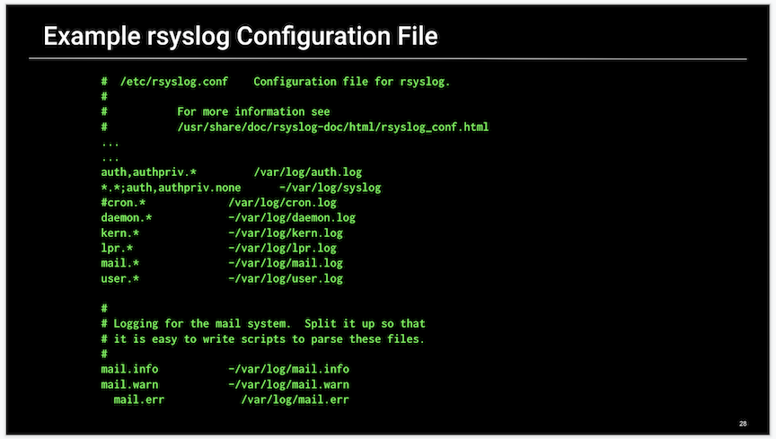
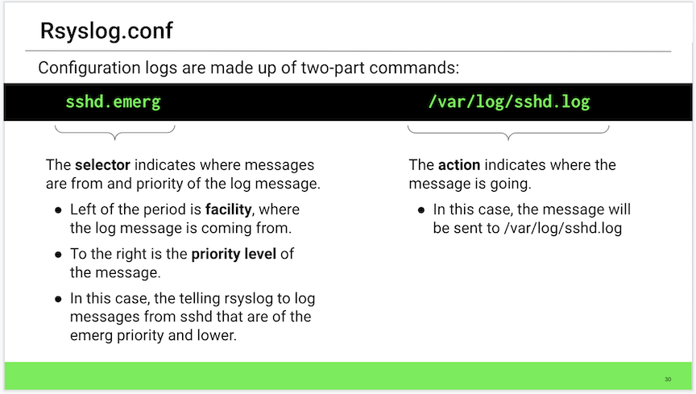
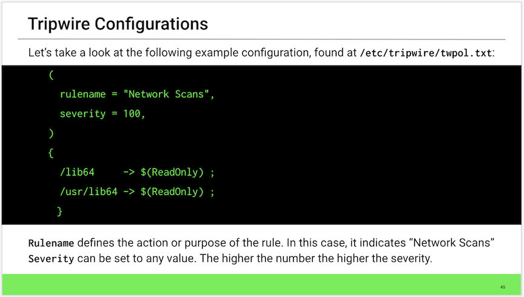

## 5.3 Student Guide: Sysadmin Essentials: Monitoring Log Files

### Overview

Today’s lesson introduces Linux log management. 

We'll perform log file management tasks; trace a series of historical events to establish whether or not a breach has occurred; and audit logs that provide critical insight into an attacker’s tactics, techniques, and procedures.

To investigate suspicious network activity, students will learn how to manage log size, and enable, troubleshoot, monitor, and audit logs using `rsyslog`, `journalctl`, `tripwire`, `logrotate`, and `auditd`.


### Learning Objectives

By the end of this lesson, you will be able to:

-  Filter `cron` and `boot` log messages using `journalctl` and `rsyslog`.

-  Build an alerting system using `tripwire` that records and generates alerts when logs are modified.

-  Perform log size management using Logrotate.

-  Install and configure audit rules using `auditd`, and write audit logs to disk.

### Lab Environment

This lesson's will use the **Ubuntu** lab environment. 

- **Note:** The Tripwire activities require the use of additional passwords:
    - Local passphrase: `studentlearning`
    - Site passphrase: `instructorteaching`


### Slideshow

The slides for today can be viewed on Google Drive here: [5.3 Slides](https://docs.google.com/presentation/d/1Ik4iG-LcNIpFUYUjafKOVow-O5NEkvSIarSgRB2XfAI/edit)

- **Note:** Editing access is not available for this document. If you or your students wish to modify the slides, please create a copy by navigating to File > "Make a copy...".

---

### 01. Overview of Log Filtering 

In today's lesson, we will continue our overview of logging and dive deeper into the security implications of log management.

- Remember that we previously covered how to write basic scripts that use `cron` to automate and schedule tasks like backups, updates, and cleanups.

- Now, we will learn how to manage log size, and enable, troubleshoot, monitor, and audit logs using `rsyslog`, `journalctl`, `tripwire`, `logrotate`, and `auditd`.


By now, you should be aware of the value that logs provide to an organization's technical and security teams:

- They provide an enormous amount of detail on a network, including security, server performance, system errors, and any underlying system issues.

- Logs contain valuable data, such as PII, that must be protected.

The importance of these resources means they require **proper log management practices**. These include:  

- Ensuring changes in logs are documented.

- Storing logs for a sufficient amount of time for archival purposes.

- Omitting the right amount of data from logs, to avoid irrelevant or gratuitous data.


There are direct security implication of log management:

- When we properly manage our logs, we are able to analyze and review them regularly, in order to rapidly pinpoint security threats, regulatory violations, and fraudulent activity. We can identify:

    - Attacks in progress, known as **Indicator of Attack** or (**IOA**).
    - Attacks that already happened, known as **Indicator of Compromise** (**IOC**).  


So, what does a log management workflow look like?

Throughout the lesson, we will cover the following steps and tools used by system administrators to manage logs:

1. **Investigate an issue.** For example, applying log filters during log reviews to scope out past or current events. A log filter is a tool used to extract specific information from a log file.  

2. **System change alerts.** Establishing a log file change alerting system that compares the current file system state against known baselines. This generates alerts after detecting variations between the two.

3. **Size management.** Creating a log size management system that rotates logs to preserve log entries and keep log file sizes manageable. Log rotation is the process of closing, dating, and moving logs to another location, and replacing them with new, empty files that are ready to receive new data.

4. **Audit.** Installing and configuring a log system that audits system file changes and records those changes to disk as audit records.

#### Overview of Logs

Linux stores all log files in a centralized repository located in the `/var/log` directory.  

Depending on the situation, logs generally contain information about a specific situation or activity. For example:

-  Information related to authentication events is logged in `/var/log/auth.log`.
    - Use to detect failed login attempts.
    - Use to detect other vulnerabilities related to user authorization mechanism and brute force attacks.

- Information related to cron jobs is recorded in `/var/log/cron.log`.
   - When a cron jobs runs, information is recorded about successful execution of applications, and application errors or failures.
    - Most useful for checking error messages when a cron job fails.
		

Log directories can typically be grouped into four categories:

- **Application logs:** Store alerts generated by software as it's being used by the user. This includes when it's launched, how long it's in use, when it's closed, etc.

- **Event logs:** Contain information regarding security related events. For instance, when a user successfully or unsuccessfully logs onto a host, or when a user tries to install unauthorized software.

- **Service logs:** Contain information related to system services such as cron jobs and print jobs. 

- **System logs:** Contain information regarding system events such as boot messages, kernel errors, or anything related to the system hardware.


All of this information can grow to unmanageable sizes. Wasting time sifting through massive logs can slow down incident and recovery efforts.

- For example, a security administrator might have to scan through massive logs to find out why a particular host on the network experienced an unscheduled reboot.

There is a tool called `journalctl` designed to filter through enormous system logs to return results of very specific search criteria. 

Before we look at `journalctl`, lets take a quick look at the daemons and journals responsible for keeping track of all this system information:

- `systemd` is a daemon responsible for logging system-wide events, as well as providing to other tools the information they need to help with common system administrative tasks. 
  
  - A `daemon` is simply a computer application that operates as a background process, and is not directly controlled by a user.

  - `systemd` does not provide a reader-friendly display of log information.

- `journald` collects and stores this log information in a structured, indexed format. 

  - Since `journald` works in tandem with `systemd`, `journald` is often referred to as `systemd-journald`.

- `journalctl` allows us to access the `systemd-journald` journal and filter out desired information. 


#### `journalctl`

Now, we'll cover the syntax for filtering through log files.

`journalctl`

  - This command will return the entire contents of the system log.

  - Show the results and emphasize  how massive the log file is. 

Without using log filters, it could take all day to extract the required information needed.

To add filers with `journalctl`, we'll use the following format:

- `journalctl [options] [information being filtered]`


`journalctl --list-boots`

  - `--list-boots` is used to display lines for each individual boot. 

  - Sample output: 

    ```
    -2 915e5048b12b4b79b71ee3d0f71ce6ca Thu 2019-11-07 21:03:23 EST—Thu 2019-11-07 23:49:16 EST
    -1 69f1499b462946baab1bc26c593690cc Thu 2019-11-07 23:49:33 EST—Fri 2019-11-08 00:22:53 EST
    0 edb3c812a22d43d390c393d18ba207f1 Fri 2019-11-08 12:24:26 EST—Fri 2019-11-08 13:04:01 EST
    ```

    - The time and date information are revealed at the end of each record.

    - This information can establish a timeline of events to assist with an incident response and investigation.
    - All boot related information is stored in a log file called `boot.log`, which is located in the `/var/log/` directory.
    - `/var/log/boot.log` is a repository where all boot related messages are logged during the system boot process.

  - This filter is commonly used to:

    - Investigate boot failures or unplanned shutdowns.

    - Determine the amount of time a system has been down due to unsuspected shutdown. 

`journalctl -b`

-  `-b` is used to display messages from specific boots.

  - The `-b` option is important because boots are "anchor points" during the initial stages of a computer incident response investigation. 
  
  - Boot sequences often lead to clues that help incident responders establish a timeline of events that can lead to a trail of breadcrumbs.

- If this argument is left empty, the boot from the most recent log is shown.  


`journalctl --since yesterday`

-  `--since` filters results starting from the time specified; in this case, yesterday.

`journalctl --until "2 hours ago"`

-  `--until` filters all results before the specified time; in this case, two hours ago.


`journalctl -u cron`

- `-u` identifies the unit or "service" type that will be filtered during the log search. 

- In this case, the command only returns only results for the `cron` service.


`journalctl -p err -b -10`

- This command filters log messages based on priority. 

- In this case, it will return all priorities equal to or lower than `err`.

- Syntax breakdown:

	- `-p` is the message priority. Log messages will be filtered based on their priority level.
	- `err` is the priority level being queried. It will only return results with a priority level of error and lower.
	- `-b` is the option used to show messages from a specific boot, and will add a match for the boot ID.
	- `-10` is the boot ID record taken from the `--list-boots` command.

- The different types of priorities.

  - `emerg` or `0`: System is unusable.
  - `alert` or `1`: Action must be taken immediately.
  - `crit` or `2`: Critical conditions.
  - `err` or `3`: Error conditions.
  - `warn` or `4`: Warning conditions.
  - `notice` or `5`: Normal but significant condition.
  - `info` or `6`: Informational messages.
  - `debug` or `7`: Debug-level messages.

- The `-p` option accepts either a single numeric or textual value.
  - `journalctl -p 0` or `journalctl -p emerg`


- We can also designate a range of numeric and text log levels using _from_ and _to_. For example:
  - Numeric range: `journalctl -p 5..7` 
  - Textual range: `journalctl -p notice..debug`


Log sizes need to be managed in order to save disk space. If left unchecked, log file sizes can grow beyond the limits set by the system defaults, which can potentially lead to data loss, a form of denial of service. 

- To avoid these issues, `journalctl` has the `--vacuum-size=` option.


`journalctl --vacuum-size=5M`

- `vacuum` refers to buffer space and `size` refers to the size of that space.

- `--vacuum-size=` is a command option that removes archived logs until the disk space they occupy falls below the specified file size.

  - Size is measured in bytes:
    - `K` for kilo
    - `M` for mega
    - `G` for giga
    - `T` for terabytes

`journalctl --vacuum-time=2years`

- This command removes archived logs older than the specified timespan.  
 
  - Time span is measured as:
    - `s` for seconds
    - `m` for minutes
    - `h` for hours
    - `days`
    - `months`
    - `weeks`
    - `years`


`journalctl --vacuum-files=50`

- This command reduces the number of journal files in order to stay below a specified number.


		
#### `journalctl` Demo Setup

In this demo, we'll use the `journalctl` command with the following scenario:

- There was an unexpected system reboot on November 8th at 8:07 p.m. and we need to investigate if it was an indicator of an attack.

- The IT administrator recommended that you enable **log persistence** due to a huge loss of log data that resulted from this unplanned system reboot and  improper shutdown.

	- Log persistence is the process of saving system logs across reboots to ensure they are not lost.
	
- Additionally, minutes before the host went down, there was a sharp spike in the log buffer, causing it to rapidly fill up to maximum capacity, resulting in data loss. The IT admin advised that you increase the log buffer size to 10 GB to avoid potential denial of service attacks.

	- **Log buffer** is a designated portion of memory that stores log data before it is written to disk.
	
- The security manager also wants you to implement a log management scheme that requires the removal of archived log journals, with the exception the most recent 10, and remove any archived log older than one year. 


In order to complete these tasks and properly trace a series of booting events, we need to: 

- Use `journalctl` to query the `systemd` journal.

- Apply a filter to `journalctl` that returns a list of system boots.
- Use  `journalctl` command options to extract boot events from the system log.
- Configure `journalctl` to persist log data so that data is saved across system reboots.
- Configure disk usage settings using `journalctl` to remove all archived log journals except the most recent 10, remove any archived logs older than one year, and increase log buffer size to 10 GB.


#### `journalctl` Demonstration

To begin, launch an instance of Ubuntu in your VM environment and run the following steps:

1. Use `journalctl` with the `--list-boots` option to see boot related information that `journald` knows about. 

    - Run:  `journalctl –list-boots`

  - The syntax:

    - `journalctl` is the command used to query the system journal.

    - `--list-boots` shows a tabular list of boot numbers (related to the current boot), their IDs, and the timestamps of the first and last message pertaining to the boot.

  - The output should resemble the following:
    
      
    ```bash
    -12 4ff8a11524a74c35804bba71bcf3d971 Wed 2019-11-06 22:03:13 EST—Wed 2019-11-06 22:54:11 EST
    -11 b61ba4091543420fb7ba465319fc63c9 Thu 2019-11-07 20:07:08 EST—Thu 2019-11-07 20:09:18 EST
    -10 7d897293368048678e7cf1c77423b72b Thu 2019-11-07 20:14:22 EST—Thu 2019-11-07 20:17:10 EST
    -9 15bc374eeb284f04bd236d9f6875a55b Thu 2019-11-07 20:22:35 EST—Thu 2019-11-07 20:25:10 EST
    -8 bdfd3ff78d884603b460b4ac6b77cbf6 Thu 2019-11-07 20:31:17 EST—Thu 2019-11-07 20:32:31 EST
    -7 a2ad4fac30a2441b889fbb772ebb279a Thu 2019-11-07 20:37:31 EST—Thu 2019-11-07 20:37:49 EST
    -6 7bd5208f421b40be883a4dc6ccc13e02 Thu 2019-11-07 20:44:00 EST—Thu 2019-11-07 20:44:47 EST
    -5 125ec97f37314ae6b4e1dd7ce377ce0a Thu 2019-11-07 20:49:37 EST—Thu 2019-11-07 20:50:22 EST
    -4 0073c5a568c84133b33df8cca6d45546 Thu 2019-11-07 20:51:06 EST—Thu 2019-11-07 20:57:18 EST
    -3 cd790b15441b445dabeca3a3b018ffe9 Thu 2019-11-07 21:01:26 EST—Thu 2019-11-07 21:02:28 EST
    -2 915e5048b12b4b79b71ee3d0f71ce6ca Thu 2019-11-07 21:03:23 EST—Thu 2019-11-07 23:49:16 EST
    -1 69f1499b462946baab1bc26c593690cc Thu 2019-11-07 23:49:33 EST—Fri 2019-11-08 00:22:53 EST
    0 edb3c812a22d43d390c393d18ba207f1 Fri 2019-11-08 12:24:26 EST—Fri 2019-11-08 13:04:01 EST
    ```

- The `--list-boots` option will sort the most recent boots from newest to oldest, from with the newest at the bottom. 
	
  - The progression from recent boots runs from  the most recent (`0`) to the oldest (`-12`).

  - Notice that line 11 of the boot list (`Thu 2019-11-07 20:07:08 EST`) is the time we need to focus on. We’ll begin to look more closely at that boot event.

2. Next, perform a search, or **query**, of the boot log using the specified boot ID of `-11`.

    - Run `journalctl -b -11` and point out that the system reported a system crash at the time in question.

    - The syntax:

      - `-b` shows messages from a specific boot which is specified by a boot ID.
      - `-11` is the desired boot ID.

    - The output is: 	

      ```bash
      Nov 07 20:07:14 cyber-security-ubuntu grub-common[758]:  * Recording successful boot for GRUB
      Nov 07 20:07:14 cyber-security-ubuntu apport[685]:  * Starting automatic crash report generation: apport
      ```

    - Note the following: 

      - The system reported a crash, as seen on the second line, `Starting automatic crash report generation`.

      - The unplanned system reboot was the result of a system crash and not an attack.


3. We also need to enable log persistence, which ensures that system logs are saved across reboots. We'll accomplish this with the `-u` option, known as _unit_, which specifies the type of service to filter from the `systemd` log. 

    - Run: `sudo journalctl -u systemd-journald`
      
      - Break down the syntax:

        - `-u` shows messages for a specific service.
        - `systemd-journald` is the system service that collects and stores logging data.
    
    - The output will look like: 
     
      ```bash
      -- Reboot --
      Dec 04 01:10:08 ubuntu-vm systemd-journald[228]: Journal started
      Dec 04 01:10:08 ubuntu-vm systemd-journald[228]: Runtime journal (/run/log/journal/0df45c6932714df292af87b90dcbcca3) is 4.9M, max 39.4M, 34.5M free.
      Dec 04 01:10:08 ubuntu-vm systemd-journald[228]: Time spent on flushing to /var is 1.985ms for 455 entries.
      Dec 04 01:10:08 ubuntu-vm systemd-journald[228]: System journal (/var/log/journal/0df45c6932714df292af87b90dcbcca3) is 40.0M, max 4.0G, 3.9G free.      
      ```
    
   Note the following about the output:
      - `max` is the maximum size of the persistent journal.   
      - `trying to leave` indicates the size of available space the system is attempting to create.

   - In order to persist logs, the `Storage` line in  the `/etc/systemd/journald.conf` file will need to be uncommented and its value will need to be set to `Storage=auto`.

      - These settings are defined in `/etc/systemd/journald.conf`.
   
    - Run: `sudo nano /etc/systemd/journal.conf`

         ```bash
      [Journal]
      #Storage=auto
      ```   
      - `Storage=` is the persistence setting.
   	  
        - `auto` indicates logging persistence, if space is available.
        - `persistence` indicates logging persistence.  
        - `none` indicates logging persistence is disabled.
   
   - Uncomment the line by removing the hash symbol to enable persistence.
   
   - Whenever the `journal.conf` file is modified, `systemd-journald` needs to be restarted before the changes take effect.

    - Run: `$ sudo systemctl restart systemd-journald`
 
      - Log persistence is now enabled.

4. Next, we'll increase the log buffer size to 10 GB. We'll use the `--vacuum-size=` command option to remove archived journals until the disk space they occupy drops below the indicted value. 

   - Run: `journalctl --vacuum-size=10G`
    
    - The syntax:

      - `--vacuum-size=` is the command used to remove archived journals until the disk space they use falls below the specified size.
      - `10G` is the specified size of the log buffer.


5. To remove archived log files according to a specific time span, we can use the `--vacuum-time=` option. 

    - Run `journalctl --vacuum-time=1year`
      
    - The syntax:

      - `journalctl` is the command used to query the system journal.
      - `--vacuum-time=` removes archived journals that are older than the specified range.
      - `1 year` is the specified date range. Log archives older than one year will be removed.


6. There are alternative ways to remove archived journals. For example, we can remove all archived journals except the most recent 10:

    - Run: `journalctl --vacuum-file=10`
      
    - The syntax:
      - `--vacuum-file=` is the option to remove a specified number of files.
      - `10` is the numeric value specifying that all but the most recent 10 log archives will be removed.


#### Demo Summary

- `journalctl` queries the `systemd` journal.

- `--list-boot` displays a tabular list of boot numbers (related to the current boot), their IDs, and the timestamps of the first and last message related to the boot.
- `-b` displays messages from a specific boot.
- `-u` filters by service type.
- `-p` filters based on log message priority.
- `--since` filters logs starting from a specific time.
- `--until` filters logs up to a specific time.
- `--vacuum-size=` removes archived logs until the disk space they occupy falls below a specified value.
- `--vacuum-time=` removes archived logs older than the specified timespan.
- `--vacumm-files=` reduces the number of logs so they stay below a specified value.

Knowing how to manage logs using `journalctl` is a crucial skill for security administrators. While this was a basic introduction to `journaltcl` and `systemd`, these skills are very useful when administering Linux systems.


### Overview of `rsyslog`

`rsyslog` provides features that `journalctl` lacks. While they differ, the are both important tools that work together to form a more cohesive log management ecosystem.

- While `journalctl` provide security admins with the capability of filtering through massive logs, it also has some limitations: 
  - It doesn't provide allow us to create new logs. 

  - It doesn't set priorities for alerts that can specify which types should be logged.

`rsyslog` records log messages from different areas of the Linux system, which can be local or remote, and routes those messages to the appropriate log located in the `/var/log` directory.


- `rsyslog` can filter logs based on different priority levels for individual services that are specified within the configuration file. This can be thought of as priority-based log filtering.

  -  `rsyslog` uses the same priority levels as `journalctl`, such as `crit` or `emerg`.

  - Individual services are also the same, such as, `cron` or `print` services.

`rsyslog` can send log messages to specific directories as determined by its configuration file. This configuration file contains parameters that specify which services to create logs for.

-  `rsyslog` uses configuration information contained in the `rsyslog.conf` file located in the `/etc` directory.

- The `rsyslog.conf` file tells `rsyslog` where to send logs for archiving. 

- These instructions come from a series of two-part lines contained within the `rsyslog.d/50-default.conf` file on Ubuntu systems.
   




Show the configuration file for `rsyslog`.


```bash
#  /etc/rsyslog.conf    Configuration file for rsyslog.  
#  
#           For more information see  
#           /usr/share/doc/rsyslog-doc/html/rsyslog_conf.html  
...  
...  
auth,authpriv.*         /var/log/auth.log  
*.*;auth,authpriv.none      -/var/log/syslog  
#cron.*             /var/log/cron.log  
daemon.*            -/var/log/daemon.log  
kern.*              -/var/log/kern.log  
lpr.*               -/var/log/lpr.log  
mail.*              -/var/log/mail.log  
user.*              -/var/log/user.log  

#
# Logging for the mail system.  Split it up so that  
# it is easy to write scripts to parse these files.  
#  
mail.info           -/var/log/mail.info  
mail.warn           -/var/log/mail.warn  
mail.err            /var/log/mail.err  
```

- Remember uncommenting a line makes it active.

- We can modify the `rsyslog` config file and add our own parameters. 
   


`rsyslog.conf` files consist of two-part commands:

   - The **selector** indicates where the messages are from and their priority level: _take messages from this service, at this priority._
	
   - The **action** indicates where to send the message.
	
   - These two parts, separated by white space, make up the directions that `ryslog` will take.
   
Consider the following example:

- `sshd.emerg         /var/log/sshd.log`

   
  - `sshd.emerg` is the selector, indicating which service and priority to log.
  - `/var/log/sshd.log` is the action, indicating where the journal message will be logged.
   
  This command is telling `rsyslog` to log messages from `sshd` of `emerg` level or lower, and send them to `/var/log/sshd.log`.

The selector is itself divided into two parts, separated by a dot.
   
- **Facility**, located to the left of the dot, indicates the origin of the message.

- **Priority**, located to the right of the dot, indicates the severity of the message.
   
Consider another example: 

- `cron.*`
   
   - `cron` is the facility, telling `rsyslog` to record messages generated by `cron`.
   - `*` is the priority, telling `rsyslog` to log messages of all priorities.

Note the different facility types:

  - **`auth`**: Security/authorization messages.
  - **`kern`**: Kernel messages.
  - **`mail`**: Messages generated by the mail system.
  - **`cron`**: Clock daemon related messages.
  - **`daemon`**: Messages coming from system daemons.
  - **`lpr`**: Printing related log messages.
  - **`user`**: User-level messages.
  - **`security`**: Security/authorization messages.

Note the different priority types:

  - **`emerg`**: System is unusable.
  - **`alert`**: Action must be taken immediately.
  - **`crit`**: Critical conditions.
  - **`err`**: Error conditions.
  - **`warn`**: Warning conditions.
  - **`notice`**: Normal but significant condition.
  - **`info`**: Informational messages.
  - **`debug`**: Debug-level messages.


Priorities can be indicated in various ways, as seen in the examples below: 
   
`mail.warn           /var/log/mail.log` 

- The `.warn` priority tells `rsyslog` to log any message with a `warn` priority or lower (`notice`, `info`, and `debug`). 

`auth.!info          /var/log/mail.info`

- The `!info` priority tells `rsyslog` to log everything from the mail subsystem **except** `info` messages.

`mail.!=info         /var/log/mail.info`  

- The equal sign `=` priority tells `rsyslog` to log all messages with a priority **above** `info`.

#### `rsyslog` Demo Setup

In the following demo, we will walk through the specific steps to configure a fully functional `rsyslog` service that will:

- Record journal messages based on a specific priority for the `lpr` (printer) daemon.

- Record journal messages to the `/var/log/lpr.log` directory.  

We'll need to do the following tasks:

- Verify the `rsyslog` installation.

- Configure `rsyslog` to specify which directories to save log data.
- Assign priorities to alerts before they are logged.
- Restart the `rsyslog` daemon to activate configuration changes.

#### `rsyslog` Demo

Begin by launching an instance of Ubuntu using your VM environment and run the following commands:


1. The first step is to use the `systemctl status` option to verify that `rsyslog` service is up and running. 

   - Run: `systemctl status rsyslog`
    
   The syntax:
    
   - `systemctl` is the command used to manage `systemd`.
   - `status` shows runtime status information about one or more services followed by most recent log data from the journal.
   - `rsyslog` is the requested service.

   The output should resemble:
    
   ```bash
   ● rsyslog.service - System Logging Service
   Loaded: loaded (/lib/systemd/system/rsyslog.service; enabled; vendor preset: enabled)
   Active: active (running) since Sun 2019-10-27 09:43:30 PDT; 1h 45min ago
     Docs: man:rsyslogd(8)
           http://www.rsyslog.com/doc/
    Main PID: 709 (rsyslogd)
       Tasks: 4 (limit: 2290)
   CGroup: /system.slice/rsyslog.service
           └─709 /usr/sbin/rsyslogd -n
   ```

   - We are looking for status `active`. Note the following line: 

   ```bash
   Active: active (running) since Sun 2019-10-27 09:43:30 PDT; 1h 45min ago
   ```

2. The next step is to edit the `rsyslog.d/50-default.conf` file and uncomment the `lpr` line.

    Type the following command and explain that before editing the `rsyslog.conf` file, the service must be stopped:
   
      - `sudo service rsyslog stop`
   
    The syntax:
   
      - `sudo` changes user privileges to user `root`.
      - `service` indicates type of application.
      - `rsyslog` specifies type of application.
      - `stop` indicates action to perform.

   Type the following command:

      - `nano /etc/rsyslog.d/50-default.conf` 
    
   The syntax:
    
      - `nano` is the text editor used to configure the file.
      - `/etc/rsyslog.d/50-default.conf` is the relative path to the config file that will be edited.
   
   Output will look similar to below:
   
   ```bash
   #  Default rules for rsyslog.
   #
   #  For more information see rsyslog.conf(5) and /etc/rsyslog.conf
   
   #
   # First some standard log files.  Log by facility.
   #
   auth,authpriv.*                 /var/log/auth.log
   *.*;auth,authpriv.none          -/var/log/syslog
   cron.*                          /var/log/cron.log
   #daemon.*                       -/var/log/daemon.log
   kern.*                          -/var/log/kern.log
   #lpr.*                          -/var/log/lpr.log
   mail.*                          -/var/log/mail.log
   #user.*                         -/var/log/user.log

   #
   # Logging for the mail system.  Split it up so that
   # it is easy to write scripts to parse these files.
   #
   #mail.info                      -/var/log/mail.info
   #mail.warn                      -/var/log/mail.warn
   mail.err                        /var/log/mail.err
   ```
   
   We will need to uncomment the `lpr` line to make it active as follows:
   
   ```bash
   lpr.*                          -/var/log/lpr.log
   ```

    Break down the syntax:
      
      - The **facility** (`lpr`) is the service.
      - The **priority** (`*`) states that all priorites will be logged.
      - The **action** (`-/var/log/lpr.log`) states where the journal message will be logged.
   
Type the following command:
   
   - `sudo service rsyslog start`
   
In order for changes to take effect, the `rsyslog` needs to be started.

#### Demo Summary

- In the this demo, we walked through the steps for configuring a fully functional `rsyslog` service that records priority based alerts by sending them to specific log directories.  

Point out that the main tasks we needed to complete were:

- Verify the `rsyslog` installation.

- Configure `rsyslog` to create new log files.

- Use `rsyslog` to specify directories where log data will be saved.

- Assign priorities to alerts before they are logged.

- Restart the `rsyslog` daemon to enact configuration changes.

`rsyslog` also allows us to establish centralized log servers that can be located remotely. This lets us send logs that were created locally to be stored at remote locations. 


### 03. Log Filtering 

- [Activity File: Log Filtering](./Activities/02_Log_Filtering/Unsolved/README.md)


### 04. Review Log Filtering 

- [Solution Guide: Log Filtering](./Activities/02_Log_Filtering/Solved/README.md)

### 05. Log Change Management 

Today is all about log management and we’ve already learned how to filter through logs. Often, attackers will modify system files to hide their tracks and remain undetected. Next, we’ll learn how to se tup an alerting system for deleted or modified logs, to help mitigate those threats.

Consider the following scenario:

- Imagine an intruder has breached your network. 

  - How you would know this breach occurred?
  - Where would you begin your investigation? 
  - Did the attackers leave behind a trail of breadcrumbs?
   
- Some of the most severe information security attacks were discovered a year or more after they occurred. Highly advanced attackers are quite good at clearing their tracks by skillfully deleting or modifying log files. 

- Log change management helps mitigate these types of threats by monitoring log file changes against a good known baseline, which records and generates alerts when changes to log files occur.

   
Modified or deleted files pose threats to organizations that could lead to potential compliance violation such as HIPAA for health organizations that handle and store Personal Health Information, or PHI.

Log change management provides security administrators with the ability to identify the following types of attacks:

- **IOA (Indicator of Attack):** Attacks in progress. 
- **IOC (Indicator of Compromise):** Attacks that occurred in the past. 

We'll use **Tripwire** to create a system that generates and logs alerts whenever a log file is deleted or modified.

- Some examples of Linux system attributes that Tripwire monitors:

   - File addition, deletion, and modification
   - File permissions and properties
   - Access timestamp
   - Modification timestamp
   - File type and file size
   - User ID of owner and group ID of owner

- It’s impossible to monitor every change within the Linux file system, nor is it prudent to even attempt to do so. This is why Tripwire is such a critical tool, because it provides the capability to monitor any and all files within a Linux system while generating alerts.

#### Tripwire Overview

Tripwire is the command line tool designed for Linux operating systems that alerts security administrators to network attacks by performing regular integrity checks of a server's file system against a known good baseline.

- To be effective, Tripwire should be installed and running at all times to ensure that the system integrity.

-  Tripwire **must** also be installed on a clean and unaffected host. This ensures that Tripwire operates 100% efficiently and does not produce faulty results.

- Tripwire is a policy based intrusion detection system that uses a configuration file that tells it which files and directories to monitor.

  - The Tripwire policy file `twpol.txt` exists in the `/etc/tripwire/twpol.txt` directory.

#### Tripwire Rules

Explain that policy rules indicate how Tripwire will validate a particular directory or file.

- Two kinds of policy rules exist for Tripwire:

	- **Normal rules** indicate which properties of a particular file or directory tree to monitor.
	- **Stop points** indicate which files or directories to _not_ scan.

Rules have attributes that let you define report-friendly information, such as a rule names, email addresses, and commands to execute if under attack.

  - Some examples of rule attributes include:

      - `rulename`: Designates a name for the rule.

      - `severity`: Value from 0 to 1000000. Applies only if the severity is specified during an integrity check.

      - `emailto`: The email address contacted by Tripwire if an issue exists.
        - When using email addresses, Tripwire can notify different stakeholders of an attack. For example, the security manager can be alerted when modifications are made in directories such as `/etc` or `/sbin`.



As an example, look at the following Tripwire configuration:

   ```bash
   (
     rulename = "Network Scans",
     severity = 100,
   )
   {
     /lib64     -> $(ReadOnly) ;
     /usr/lib64 -> $(ReadOnly) ;
   }
   ```

   - `rulename`: A value that defines the action or purpose of the rule.
   - `severity`: This can be set to any value, the higher the number, the higher the severity.

   - **Note:** We will cover variables such as `$(ReadOnly)` in a future lesson.

   Run the following command:

   - `tripwire --version`
    
     - `tripwire` is the software being verified.
     - `---version` is the option used to show what version of software is currently installed.
    
   The output will look similar to below.
	
   ```Bash
   Open Source Tripwire(R) 2.4.3.1.0 built for x86_64-pc-linux-gnu

   The developer of the original code and/or files is Tripwire, Inc.  Portions
   created by Tripwire, Inc. are copyright 2000 Tripwire, Inc. Tripwire is a
   registered trademark of Tripwire, Inc.  All rights reserved.
   ```

   - It's generally a good idea to check what version of software you are running and documenting it for version control purposes.
   We can see that we're running version `2.4.3.1.0`.

Why is checking version numbers are critical.

- Version numbers can be checked against the Common Vulnerabilities and Exposures (CVE) database—a public collection of known cybersecurity vulnerabilities—and subsequently mitigated.

#### Tripwire Demo Setup

Next,  we'll demonstrate how to use Tripwire with the following scenario:

- The IT administrator has found some logs are missing. They would like you to install a system that monitors log file deletions or modifications and sends email alerts to `sysadmin@compay.org`.

The steps we need to take are:

- Use `--version` option to verify the currently installed version of Tripwire.
- Use `--init` to initialize Tripwire.

- Use  `--check` to verify the Tripwire installation.
- Configure `crontab` under `root` user privileges to perform automated file integrity checks.
- Edit ` /etc/tripwire/twpol.txt` and add `emailto=` to specify which email to send reports to.
- Configure `crontab` under `root` user privileges to automate the sending of email reports.


#### Tripwire Demo

For this demo, launch an instance of Ubuntu using your VM environment and run the following commands:
1. Install `tripwire`. 

    ```bash
    - apt install tripwire
    # When asked "Do you wish to create/use your site key passphrase during installation?"
    - Select: Yes
    # When asked "Do you wish to create/use your local key passphrase during installation?"
    - Select: Yes
    # When asked "Rebuild Tripwire configuration file?"
    - Select: Yes
    # When asked "Rebuild Tripwire policy file?"
    - Select: Yes
    # Enter site-key passphrase:
    - Explain to students that it does not have to be your login password but it needs to be a passphrase you will remember.
      - Enter: instructor
      
    # Repeat the site-key passphrase:
    - Enter: instructor
    # Enter local key passphrase:
    - Enter: instructor
    # Repeat the local key passphrase:
    - Enter: instructor
    ```

1. Check the version of `tripwire` that currently installed. 

   Type the following command:

   - `tripwire --version`

    The output should look similar to below:
	
	```bash
	Open Source Tripwire(R) 2.4.3.1.0 built for x86_64-pc-linux-gnu
	```
	- The version of software is critical for version control.

		- Version control is the process by which software packages are tracked and updated as part of a software patch management strategy.

		- Patch management is the process that ensures software is kept up to date to help mitigate vulnerabilities.

2. Next, we'll need to initialize `tripwire`.

    Type the following command:

    - `sudo tripwire --init`
      
    
       - `sudo` is the command used to change into `root` user privilege level.
        - `tripwire ` specifies which software will be initialized.
       - `-init` is the command option to initialize software.

    We'll need to enter their `local-key-passphrase`: `studentlearner`.
    
    ```bash
    Please enter your local passphrase:
    Parsing policy file: /etc/tripwire/tw.pol
    Generating the database...
    *** Processing Unix File System ***
    The object: "/dev/hugepages" is on a different file system...ignoring.
    The object: "/dev/mqueue" is on a different file system...ignoring.
    The object: "/dev/pts" is on a different file system...ignoring.
    The object: "/dev/shm" is on a different file system...ignoring.
    Wrote database file: /var/lib/tripwire/ubuntu.twd
    The database was successfully generated.
    ```
    - Note the message at the bottom: `The database was successfully generated.`  This tells us that `tripwire` was successfully initialized.


3. Next, we'll need to perform a `tripwire` check.

   - `tripwire` needs to be run under `root` user privileges.
        
   Run:
    
   - `sudo tripwire --check`
      - `-check` is the command option to check the `tripwire` installation.

	
    ```bash
    Parsing policy file: /etc/tripwire/tw.pol
    *** Processing Unix File System ***
    Performing integrity check...
    The object: "/dev/hugepages" is on a different file system...ignoring.
    The object: "/dev/mqueue" is on a different file system...ignoring.
    The object: "/dev/pts" is on a different file system...ignoring.
    The object: "/dev/shm" is on a different file system...ignoring.
    Wrote report file: /var/lib/tripwire/report/ubuntu-20191027-132844.twr

    Open Source Tripwire(R) 2.4.3.1 Integrity Check Report
    
    Report generated by:          root
    Report created on:            Sun Oct 27 13:28:44 2019
    Database last updated on:     Never

    ===============================================================================
    Report Summary:
    ===============================================================================

    Host name:                    ubuntu
    Host IP address:              127.0.1.1
    Host ID:                      None
    Policy file used:             /etc/tripwire/tw.pol
    Configuration file used:      /etc/tripwire/tw.cfg
    Database file used:           /var/lib/tripwire/ubuntu.twd
    Command line used:            tripwire --check

    ===============================================================================
    Rule Summary:
    ===============================================================================

    -------------------------------------------------------------------------------
        Section: Unix File System
    -------------------------------------------------------------------------------

    Rule Name                       Severity Level    Added    Removed  Modified
        ---------                       --------------    -----    -------  --------
        Other binaries                  66                0        0        0        
        Tripwire Binaries               100               0        0        0        
        Other libraries                 66                0        0        0        
        Root file-system executables    100               0        0        0        
        Tripwire Data Files             100               0        0        0        
        System boot changes             100               0        0        0        
        (/var/log)
        Root file-system libraries      100               0        0        0        
        (/lib)
        Critical system boot files      100               0        0        0        
        Other configuration files       66                0        0        0        
        (/etc)
        Boot Scripts                    100               0        0        0        
        Security Control                66                0        0        0        
        Root config files               100               0        0        0        
        Devices & Kernel information    100               0        0        0        
        (/dev)
        Invariant Directories           66                0        0        0        

        Total objects scanned:  32797
        Total violations found:  0

        ===============================================================================
        Object Summary:
        ===============================================================================

        -------------------------------------------------------------------------------
        # Section: Unix File System
        -------------------------------------------------------------------------------

        No violations.

        ===============================================================================
        Error Report:
        ===============================================================================

        No Errors

        -------------------------------------------------------------------------------
        *** End of report ***
        ```
        
 - We should see zeros in the `Added`, `Removed`, and `Modified` columns on a fresh installation, indicating a clean install. 

 - The bottom of the output should be as follows:
    - `no violations`: Validates that `tripwire` was cleanly installed.
    - `no errors`: Verifies that the `tripwire` configuration is configured properly.

    This tells us that `tripwire` was successfully initialized.

4. `tripwire` checks can also be automated by creating a `root` user cron job.

   Type the following command:

   - `sudo crontab -e`
    
     - `sudo` is the command used to change into `root` user privilege level.
     - `crontab` is the configuration file to be edited.
     - `-e` is the `crontab` command option for `edit`.

    Point out that it's best practice to add all new cron jobs to the bottom of the crontab.

5. The email function built in to Tripwire allows the network admin to send emails as part of a `cron` job.
   
   First, we’ll send a test email to ensure the system has email capabilities.
   Type the following command:

   - ` tripwire --test --email sysadmin@company.com`
    

    
     - `tripwire ` specifies which software will perform the test.
     - `--test` tells `tripwire ` to perform a test function that is not part of the configuration file.
     - `--email` tells `tripwire` which action to perform.
     - `sysadmin@company.com` is the address the test email will be sent to. 
   
    **Note**: You may have to check your spam folder. When we know email works, we have to edit ` /etc/tripwire/twpol.txt` and add `emailto=` and the email address to the configuration file.
   
   Type the following command:

   - `sudo nano /etc/tripwire/twpol.txt`
    
     - `sudo` is the command used to change into `root` user privilege level.
     - `nano` opens the Nano text editor.
     -  `/etc/tripwire/twpol.txt `is the configuration file that will open in the Nano editor.

   Let's look at the following config.
   
   ```bash
   (
     rulename = "Network Scans",
     severity = 100,
     emailto = "crimefighter@mail.com;sysadmin@mail.com"
   )
   {
     /lib64     -> $(ReadOnly) ;
     /usr/lib64 -> $(ReadOnly) ;
   }
   ```
   
   Before email will work, the following configuration changes must occur:
    - Add a comma (`,`) at the end of `severity = 100`.
    - Add a new line that includes the `emailto=` attribute.
    - Add the `sysadmin@company.com` email address after the equals (`=`) sign.
    
   Whenever a Tripwire configuration file is modified, it will need to be regenerated before it any changes can take effect.
   
   - `sudo twadmin -m P /etc/tripwire/twpol.txt`
   
 
    
     - `twadmin` utility is used to perform administrative functions for Tripwire configuration options.
     - `-m` selects the mode for creating a policy file.
     - `P` specifies the destination of the policy file.
     - `/etc/tripwire/twpol.txt` is the `crontab` command option for `edit`.

   
   We will need to enter your `passphrase` again, which is `studentlearner`.

   ```bash
   Please enter your site passphrase:
   Wrote policy file: /etc/tripwire/tw.pol
   ```

   If we see `Wrote policy file: /etc/tripwire/tw.pol` at the bottom, then the file was successfully regenerated.

   
6. After verifying the configurations file by sending a test email successfully, it's time to create a `root` cron job.
 
   Type the following command:

   - `sudo crontab -e`
    
     - `sudo` is the command used to change into `root` user privilege level.
     - `crontab` is the configuration file to be edited.
     - `-e` is the `crontab` command option for `edit`

   It's best practice to add all new cron jobs to the bottom of the crontab.
   
   Cron job command below:

   ```bash
   0 5 * * 6 /usr/sbin/tripwire --check --email-report
   ```
   
   - `0 5 * * 6` The cron job will run at 5 a.m. every Sunday.
   - `/usr/sbin/tripwire` is the command that will run.
   - `--check` is the action that the command will perform.
   - `--email-report` is the command option that will send an email to the address specified within the `/etc/tripwire/tw.pol` configuration.


#### Demo Summary

- Use `--version` option to verify the currently installed version of Tripwire.
- Use `--init` to initialize `tripwire`.

- Use  `--check` to verify the `tripwire` installation.
- Configure `crontab` under `root` user privileges to perform automated file integrity checks.
- Edit ` /etc/tripwire/twpol.txt` and add `emailto=` to specify which email to send reports to.
- Configure `crontab` under `root` user privileges to automate the sending of email reports.

### 06. Log Change Management Activity 

- [Activity File: Log Change Management](./Activities/04_Log_Change_Management/Unsolved/README.md)


### 07. Review Log Change Management 

- [Solution Guide: Log Change Management](./Activities/04_Log_Change_Management/Solved/README.md)

### 07. Break 

### 08. Log Size Management

Next, we'll continue covering tools of proper log management by learning how to manage log file size to help make managing logs easier.

The purpose of log files is to preserve information regarding system events for a fixed period of time. Unfortunately, logging daemons do not provide a way to control the size of log files.

- If left unchecked, log file sizes can grow to unmanageable sizes that potentially consume all available space on a disk.

- As an example, imagine that your senior security administrator asked to you check the system logs for any possible sign of a breach. Now, imagine that the server has been logging data non-stop since the system started running two and a half years ago.

- Querying a log file with that much data would be daunting, because the server would need to read through massive log directories. This not only wastes large amounts of system resources, but also time.

For this reason, security professionals use a method called **Log Rotation**. In this lesson, we'll use a software tool called Logrotate.

Logrotate is an application that administratively manages the size of log files to keep them small and manageable.

Some benefits to using log rotation:

- Scheduling the creation of new log files.

- Compressing log files in order to save hard drive space.
- Executing commands prior to or after a log is rotated.
- Time stamping old logs and renaming them during rotation.
- Log file archive pruning maintains only a certain number of backlogs.
- Smaller archives mean faster transfer times.

Logs are rotated based on a schedule. With Logrotate, when a specific threshold is reached, the current log is closed, saved, dated, and rotated out. At this point, a brand new, empty log file is opened that starts recording new journal messages, known as log data.

#### Logrotate Configuration file

Logrotate learns everything it needs to know about log files, including how to handle them, from a series of configuration files specified within `/etc/logrotate.conf`. Each configuration file sets options and parameters and also specifies which log files to rotate.

The following is an example of a Logrotate configuration for the Apache web server:

   ```bash
   /var/log/apache2/*.log {
	daily
	missingok
	rotate 14
	compress
	delaycompress
	notifempty
	endscript
   }
   ```

In this example, the configuration begins with the directory in which the action will take place. In this case, for `apache2`, the directory is `/var/log/apache2/*.log`.
  - `*.log` means that all files in the `apache2` will be rotated.
   
   - Everything contained within the braces `{}` are the configuration options. These options tell Logrotate what actions to take during rotation.
   	
The main options of the `logrotate.d` file are:

  - `daily`: Rotate out existing logs every day.

  - `missingok`: If the log file is missing, go on to the next one without issuing an error message.
  - `rotate`: Specifies the number of rotations before a log is removed or emailed. When set to `0`, old versions of logs are removed rather than rotated.
  - `compress`: gzip is the default compression used for log files, but other compression types may be used.
  - `delaycompress`: Postpone compression of the previous log file to the next rotation cycle. This only has effect when used in combination with `compress`.
  - `notifyempty`: Do not rotate the log if it is empty (this overrides the `ifempty` option).

  
#### `logrotate` Demo Setup

We'll demonstrate how to use Logrotate with the following scenario:

- The IT administrator told you that it took over six hours to transfer several log files to a remote server.
- This is done every four years and, as a result, the logs grow to unmanageable sizes.
- The IT administrator asked that you implement a log size management process that will:

   For the `mail.log`:
   - Keep eight weeks of backlogs.
   - Rotate logs daily.
   - Create new empty logs after rotating out the old ones.
   - Not rotate empty logs.
  
   For the `dmesg` log:
   - Keep 10 weeks of backlogs.
   - Rotate logs weekly.
   - Create new empty logs after rotating out the old ones.
   - Compress logs before moving them to save disk space. 


The steps that we need to complete are:

- Check the version of Logrotate currently installed and document for version control. 

- List the directories in `logrotate.d` to display the default configuration files for installed applications.
	- If the config file exists, we can simply edit it.
	- If the config file doesnt exist, we can add the config to `/etc/logrotate.conf`.

- Perform version control by checking the Logrotate version currently installed.

- Configure Logrotate by editing the `/etc/logrotate.conf` file and add the following settings:

	- Use the `rotate` setting to keep the most recent eight weeks of backlogs.
	- Use the `create` setting to create a new log every time the old log is rotated.
	- Use the `notifempty` setting to not rotate empty logs.
	- Use the `compress` setting to compress logs during rotation.

- Test the configuration changes by perfoming a manual test rotation.


#### Logrotate Demo

For this demo, launch an instance of Ubuntu using your VM environment and run the following commands:


1. Logrotate’s configuration files are located in `/etc/Logrotate.d`, which specifies the default settings of system files to be rotated.

    - Point out that the output below is an example of the `/etc/Logrotate.d` file.
 
   Type the following command:

   - `ls -l /etc/logrotate.d`
    
     - `ls -l` will display a long listing of the directory.
     - `/etc/Logrotate.d` is the directory that will be listed.
   
   
   ```bash
   total 40
   -rw-r--r-- 1 root root 120 Nov 2 2017 alternatives
   -rw-r--r-- 1 root root 442 Oct 23 2017 apache2
   -rw-r--r-- 1 root root 126 Nov 20 16:39 apport
   -rw-r--r-- 1 root root 173 Apr 20 10:08 apt
   -rw-r--r-- 1 root root 112 Nov 2 2017 dpkg
   -rw-r--r-- 1 root root 146 Apr 17 17:35 lxd
   -rw-r--r-- 1 root root 845 Jan 12 10:57 mysql-server
   -rw-r--r-- 1 root root 501 Jan 14 16:19 rsyslog
   -rw-r--r-- 1 root root 178 Aug 15 2017 ufw
   -rw-r--r-- 1 root root 235 Apr 17 14:53 unattended-upgrades
   ```

   - `/etc/logrotate.d` contains a list of default configs for logs that need to be rotated.

2. By editing the `/etc/logrotate.conf` configuration file, we are changing parameters and adding new configurations that specify the locations of additional log files to be rotated.

   The output below is an example of the `/etc/logrotate.d` file.
 
   Run the following command:

   - `sudo nano /etc/logrotate.conf`
       
  - In the first log that we need to configure is `mail.log`:

      Add the following config to the bottom of the file:

      ```bash
      /var/log/mail.log {
          rotate 56
          daily
          notifempty
        endscript
      }
      ```

      - `/var/log/mail.log` creates the log and directory where the log file will be located.
      - `rotate 56` specifies to keep eight weeks of backlogs.
      - `daily` specifies to rotate logs daily.
      - `notifempty` specifies to not rotate empty logs.

  - The second log that we need to configure is `dmesg.log`:

      Add the following config to the bottom of the file:

    ```bash
    /var/log/dmesg.log {
        rotate 70
        weekly
    compress
      endscript
    }
    ```

      - `/var/log/dmesg.log` creates the log and directory where the log file will be located.
      - `rotate 70` specifies to keep 10 weeks of backlogs.
      - `weekly` specifies to rotate logs weekly.
      - `compress` specifies to compress logs during rotation.


4. Instead of waiting a day or week to find out if our configurations work, we can force a rotation by running the following command:

   - `logrotate -vf /etc/logrotate.conf`
        
      - `logrotate` is the application that will be executed.
      - `-v` is the command option specifying a verbose output will be displayed.
      - `-f` is the command option to “force” the action to occur.
      - `/etc/Logrotate.conf` is the directory that will be forced to rotate.

   This command will force `logrotate` to execute outside of it's scheduled cron job.
   
     The output will look similar to below:

      ```bash
      reading config file /etc/logrotate.conf
      including /etc/logrotate.d
      reading config file alternatives
      reading config file apport
      reading config file apt
      reading config file cups-daemon
      .
      .
      Reading state from file: /var/lib/logrotate/status
      Allocating hash table for state file, size 64 entries
      Creating new state
      .
      .
      Handling 16 logs

      rotating pattern: /var/log/alternatives.log  forced from command line (12 rotations)
      empty log files are not rotated, old logs are removed
      switching euid to 0 and egid to 106
      error: error switching euid to 0 and egid to 106: Operation not permitted

      rotating pattern: /var/log/apport.log  forced from command line (7 rotations)
      empty log files are not rotated, old logs are removed
      switching euid to 0 and egid to 106
      error: error switching euid to 0 and egid to 106: Operation not permitted
      .
      .
      rotating pattern: /var/log/mail.info
      /var/log/mail.warn
      /var/log/mail.err
      /var/log/mail.log
      /var/log/daemon.log
      /var/log/kern.log
      /var/log/auth.log
      /var/log/user.log
      /var/log/lpr.log
      /var/log/cron.log
      /var/log/debug
      /var/log/messages
        forced from command line (4 rotations)
      empty log files are not rotated, old logs are removed
      switching euid to 0 and egid to 106
      error: error switching euid to 0 and egid to 106: Operation not permitted
      ```

#### Demo Summary

Log rotation is a process by which logs are rotated on a regular basis. It is executed with the application Logrotate. During this process, files can be renamed, deleted, or compressed to save space on the hard drive’s partition.

The steps that we needed to complete were:

- Check the version of Logrotate currently installed for version control purposes. 

- Use `ls -l /etc/logrotate.d` to perform a directory listing.

- Edit `/etc/logrotate.conf` and add two configurations for `mail.log` and `dmesg.log`.

- Use `logrotate -vf /etc/logrotate.conf` to force an unscheduled log rotation.


### 09. Log Size Management Activity

- [Activity File: Log Size Management](./Activities/08_Log_Size_Management.md/Unsolved/README.md)

### 10. Review Log Size Management

- [Solution Guide: Log Size Management](./Activities/08_Log_Size_Management.md/Solved/README.md)

### 11.  Log Auditing 

Let's review the log management tools we've learned so far:

- `journalctl`: Filters through massive logs by narrowing search results to specific search criteria.
- `rsyslog`: Performs priority based log filtering and create new logs for new services using a configuration file.
- Tripwire: Establishes an early warning system for deviations between the current state of a log and a known good baseline.

- Logrotate: Manages log file sizes to make log management easier by saving disk space and decreasing file transfer times.

Although all of the tools we’ve learned about today are incredibly useful, they still lack one detail that we need for our log management ecosystem.

Next, we’ll learn how to perform log audits, which provide a way to track violations on a system by creating log rules for nearly every action taking place on a server or host.

Consider the following scenario:

- An organization experienced a breach. Tripwire worked as planned by generating system alerts because an attacker deleted and modified system logs in order to hide their tracks. Although the organization knows it's been breached, it doesn't have a way of knowing what changes the attackers made to the system.

- This information would be beneficial to not only discovering the tactics, techniques, and procedures used by the attackers, but also help provide crucial details to assist during incident and recovery efforts. 

- `auditd` fills this gap by providing organizations with the limited capability to view modifications made to a system. It will not show every single detail of changes made to a system but does provide very useful information to aid incident and recovery efforts.

A Linux Auditing System is an excellent way for sysadmins to create log rules for nearly every action on a data center server or user host. Using this system allows you to track and record events, and detect abuse or unauthorized activity, through log files.


#### `auditd` Overview

`auditd` is a subsystem, in that it works at the **kernel** level. This means that `auditd` has the capability to watch every **system call** an application makes to the core of the operating system.

- A **kernel** is the core component of any operating system that’s responisible for managing system memory, processes, task, and disk management. Essentially, the **kernel** links all system hardware to the application software. It can be thought of as the glue that binds software to hardware.

- A **system call** is when any software or application installed within an operating system makes a request for system resources.

The benefit of `auditd` having such tight integration with the system kernel is that it gives `audit` the capability to look at any system operation and monitor all activity, such as all network traffic and file system access.

The `auditd` daemon allows you to choose which actions on the server to monitor (as opposed to monitoring everything) and does not interfere with standard logging tools, such as `syslog`.

The one caveat to `auditd` is that it does not actually add any additional security to your system. Instead, it provides you the ability to keep track of violations that have already occurred on a system, allowing you to take action.

Point out that once an event is written to disk, reporting tools such as `ausearch`, `aureport`, and `aulast` are used to generate reports.

- `ausearch`: A tool designed to query `auditd` daemon logs based on different search criteria for event-driven log records.

- `aureport`: A program that summarizes various types of events.

- `auditctl`: Responsible for configuring the `auditd` system. It has the capability to enable or disable `auditd` systems, load and list rules, and generate status reports.


#### `auditd` Demo setup

We'll demonstrate how to use `auditd` with the following scenario:

- The IT security manager advised you that there was a breach and Tripwire has alerted them that several logs have been deleted. They believe the attackers are attempting to clear their tracks.

- The security manager has advised you that the attackers may have created new user accounts that would provide them with persistent access to the network. 

- You’ve been asked to find details on any new user account creations, as these will provide insight into the attacker's end goals.

The main tasks we need to complete to uncover details on any new user accounts are:

- Edit `/etc/audit/auditd/auditd.conf` and specify the following:
	- Log file Location for `auditd.log`.

	- Retain no more than 50 logs.

	- Maximum log file size of 100.

- Use `auditctl -l` to see if any rules exist.
- Edit ` /etc/audit/rules.d/audit.rules` and specify files to monitor.
- Use ` auditctl –l` to verify the new rules exist.
- Use ` systemctl restart auditd` to restart the `auditd` daemon for changes to take effect.
- Use ` auditctl –w` as an alternative way to add a new rule.
- Use `auditctl –l` to verify the new rule was added.
- Use ` aureport –au` to perform log search for user authentications.
- Use ` aureport –m` to search for account modifications.


#### `auditd` Demo

For this demo, launch an instance of Ubuntu using your VM environment and run the following commands:

1. `auditd` will need to be installed, so we'll use the `apt` package manager as follows.
 
    - Run the following command to install the package without any prompts. 

      - `sudo apt install auditd -y`

2. After the installation completes, we will need to verify the `auditd` service is active using the `systemctl` command as follows:
 
    - Run the following command:

      - `systemctl status auditd`
        
         - `systemctl` is the command used to query the system.
         - `status` specifies which query type will be made to the system.
         - `auditd ` is the service type that will be queried.

  The output will look similar to below:

   ```bash
   ● auditd.service - Security Auditing Service
    Loaded: loaded (/lib/systemd/system/auditd.service; enabled; vendor preset: enabled)
    Active: active (running) since Sun 2019-10-27 15:01:58 PDT; 2min 27s ago
      Docs: man:auditd(8)
            https://github.com/linux-audit/audit-documentation
    Main PID: 5150 (auditd)
    Tasks: 2 (limit: 2290)
    Group: /system.slice/auditd.service
            └─5150 /sbin/auditd
   ```

  From this output we observe that `auditd` is **active** and running. We can also see how long the service has been up and running (two minutes and 27 seconds).


3. Next we will need to edit the configuration file to add our settings.

   - `root` user privileges are required to configure the `/etc/audit/audit.conf` file.
 
   - Run the following command:

      - `sudo nano /etc/audit/auditd.conf`
    

   The output will be:

   ```bash
   #
   # This file controls the configuration of the audit daemon
   #
   
   log_file = /var/log/audit/audit.log
   flush = INCREMENTAL_SYNC
   max_log_file = 50
   num_logs = 10
   ```
   Some of the major `auditd.conf` file options are:

   - `log_file`: This keyword specifies the full path name to the log file where audit records will be stored. It must be a regular file.

   - `flush`: Valid values are `none`, `incremental`, `data`, and `sync`.
     - `none`: Does not flush the audit records to disk.
     - `incremental`: The frequency parameter used to specify how often an explicit flush to disk is issued.
     - `data`: Keeps the data portion of the disk file synced at all times. 
     - `sync`: Tells the audit daemon to keep both the data and metadata fully synced with every write to disk.
   - `max_log_file`: Specifies the maximum file size in megabytes. When this limit is reached, it will trigger a configurable action. The value given must be numeric.
    - `num_logs`: Specifies the number of log files to keep if `rotate` is given as the `max_log_file_action`. If the number is less than two, logs are not rotated. This number must be 99 or less. The default is zero, which means no rotation.


4. It's best practice to verify if there are any rules that currently exist before making changes or additions to the system.
   
   - Run:

      - `sudo auditctl -l`
        - `auditctl` is the `auditd` daemon service control request.
        - `-l ` command option for list.

   We should see no existing rules:

      ```bash
      No rules
      ```

   - Here we can see that we are starting with a clean slate. Let's add some configs.
   

5. We'll create a rule that will monitor both `/etc/passwd` and `/etc/shadow` for any modifications or deletions.

   - For this, we'll need to edit the `/etc/audit/rules.d/audit.rules` configuration file.
   
   - Type the following command:

      - `sudo nano /etc/audit/rules.d/audit.rules`

    - Now we need to scroll to the bottom of the config and add the following two lines:
    
      ```bash
      -w /etc/shadow -p wa -k shadow
      -w /etc/passwd -p wa -k passwd
      ```
        - `-w` specifies that the object at the following path will be watched.
        - `/etc/shadow` and `/etc/passwd` are the directories to act upon.
        - `-p` precedes the permissions to monitor.
        - `w` is the write permission.
        - `a` specifies a change in the file's attribute (either ownership or permissions).
        - `-k` is the keyname for the rule.
        - `shadow` and `passwd` are the files acted upon (those to be monitored).


4. The `auditd` daemon must be restarted prior to any changes taking effect.

   - We'll need to edit the `/etc/audit/rules.d/audit.rules` configuration file.
   
   - Run the following command:

      - `sudo systemctl restart auditd`


5. Since we've restarted the `auditd` daemon, we can now run `auditctl` to verify that our rules have taken effect.

   - We'll need to edit the `/etc/audit/rules.d/audit.rules` configuration file.
   
   - Run the following command:

      - `sudo auditctl -l`

   The config should look smiliar to below:

   ```bash
   -w /etc/shadow -p wa -k shadow
   -w /etc/passwd -p wa -k passwd
   ```

   - We can see that our rules have indeed taken affect. Now whenever `/etc/shadow` or `/etc/passwd` are modified or deleted, the action will be recorded and logged.


6. There are alternative ways to add rules to `auditd` by using the `auditctl` command without editing `/etc/audit/rules.d/audit.rules` directly.

   - We'll need to edit the `/etc/audit/rules.d/audit.rules` configuration file.
   
   - Type the following command:

      - `sudo auditctl -w /home/sysadmin/Music/`
      
      - **Note:** Notice how we didn't specify permission levels.

   - Break down the syntax:
    
      - `sudo` is the command used to change into `root` user privilege level.
      - `auditctl` is the `auditd` daemon service control request.
      - `-w ` specifies that the object at the following path will be watched. 
      - `/home/sysadmin/Music/` the specified path to watch (monitor).
      
    
7. Let's verify that the new rule took effect.

   - Type the following command:

     - `sudo auditctl -l`


   Point out the new entry at the bottom as seen in the output below:
    
   ```bash
   -w /etc/shadow -p wa -k shadow
   -w /etc/passwd -p wa -k passwd
   ***-w /home/sysadmin/Music/ -p rwxa***
   ```
   
   - **Note:** The permissions of `-p rwxa` are the default unless otherwise specified.


8. We can generate a report on authentication attempts with the `-au` option.

    Run the following to generate logs for the report:

    - `su sysadmin` (password: `cybersecurity`)  
    - `sudo useradd criminal`  
    - `exit`  
    - `su sysadmin` (password: `password`)

    Then, run:

    - `sudo aureport -au`

   
      - ` aureport ` is the tool that produces summary reports from the `auditd1` daemon.
      - `-au` is the report on authentication attempts.

    The config should look similar to below:

   ```bash
    Authentication Report
    ============================================
    # date time acct host term exe success event
    ============================================
    1. 12/06/2019 11:23:29 instructor ? /dev/pts/0 /usr/bin/sudo yes 136
    2. 12/06/2019 11:25:16 sysadmin ? /dev/pts/0 /bin/su yes 148
    3. 12/06/2019 11:25:27 sysadmin ? /dev/pts/0 /bin/su yes 161
    4. 12/06/2019 11:25:36 sysadmin ? /dev/pts/0 /bin/su no 172
   ```
   
   There are several pieces of useful information, including:
   - `acct`: The user account used during authentication.
   - `host`: The hostname that originated the login.
   - `term`: Can be one of the following:
     - `pts` (_Pseudo terminal slave_): Login device used when connecting through the network or a console (e.g., SSH).
     - `tty` (_Teletype_): Serial or console connections (text mode).
     - `:0` (`local:display #0`): X11 server, used for graphical login (e.g., GDM).


9. We can also produce `auditd` reports using the `-m` option, which searches for modifications only.

   Type the following command:

   - `sudo aureport -m`

   
     - ` aureport ` produces summary reports from the `auditd1` daemon.
     - `-m` option that creates a report on only account modifications.
   
   Output will look smilar to below:

   ```bash
   Account Modifications Report
   =================================================
   # date time auid addr term exe acct success event
   =================================================
   1. 12/06/2019 11:30:59 1001 ubuntu-vm pts/0 /usr/sbin/useradd criminal yes 203
   2. 12/06/2019 11:30:59 1001 ubuntu-vm pts/0 /usr/sbin/useradd ? yes 204
   ```

   - The modification report reflects that the `useradd` command was used to create a user called `criminal`.

   - Here we have proof that an attacker created an unauthorized account in an attempt to establish a backdoor.
   
####  Demo Summary
   
- Edit `/etc/audit/auditd/auditd.conf` and specify the following:
	- Log file location for `auditd.log`.
	- Retain no more than 50 logs.
	- Maximum log file size of 100.

- Use `auditctl -l` to see if any rules existed.
- Edit ` /etc/audit/rules.d/audit.rules` and add files to be monitored.
- Use ` auditctl –l` to verify the new rules existed.
- Use ` systemctl restart auditd` to restart the `auditd` daemon for changes to take effect.
- Use ` auditctl –w` as an alternative way to add a new rule.
- Use `auditctl –l` to verify the new rule was added.
- Use ` aureport –au` to perform log search for user authentications.
- Use ` aureport –m` to search for account modifications.


`auditd` is a great way for IT security administrators to create a log rule for nearly every action on a data center server or user host. 

With `auditd`, you can track and record events, and even detect abuse or unauthorized activity, in addition to creating custom reports.


### 12. Student Do: Event Monitor Log (0:15)

- [Activity File: Event Monitor Logging](./Activities/11_Stu_Event_Monitor_Logging/Unsolved/README.md)

### 13. Instructor Review: Event Monitor Log (0:10)

- [Solution Guide: Event Monitor Logging](./Activities/11_Stu_Event_Monitor_Logging/Solved/README.md)

-------

© 2020 Trilogy Education Services, a 2U, Inc. brand. All Rights Reserved.

